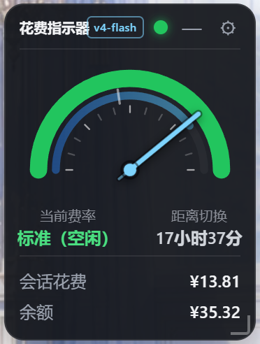
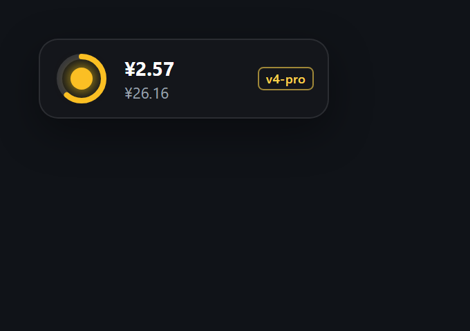
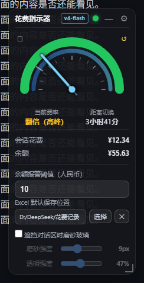
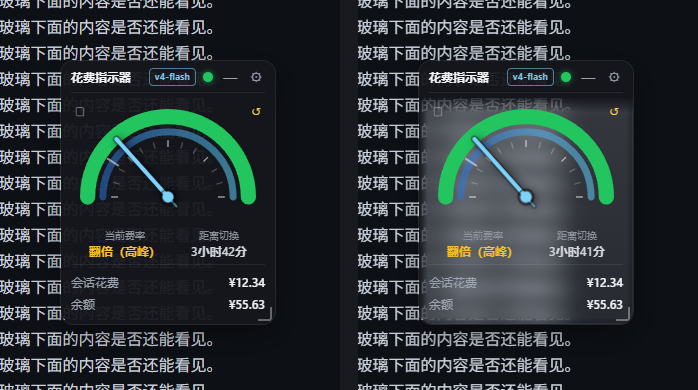
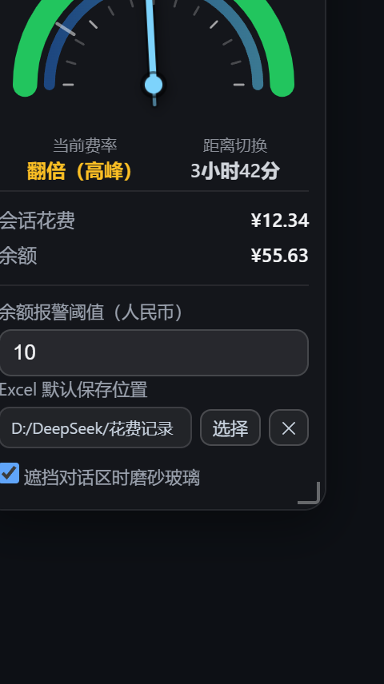
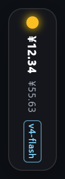
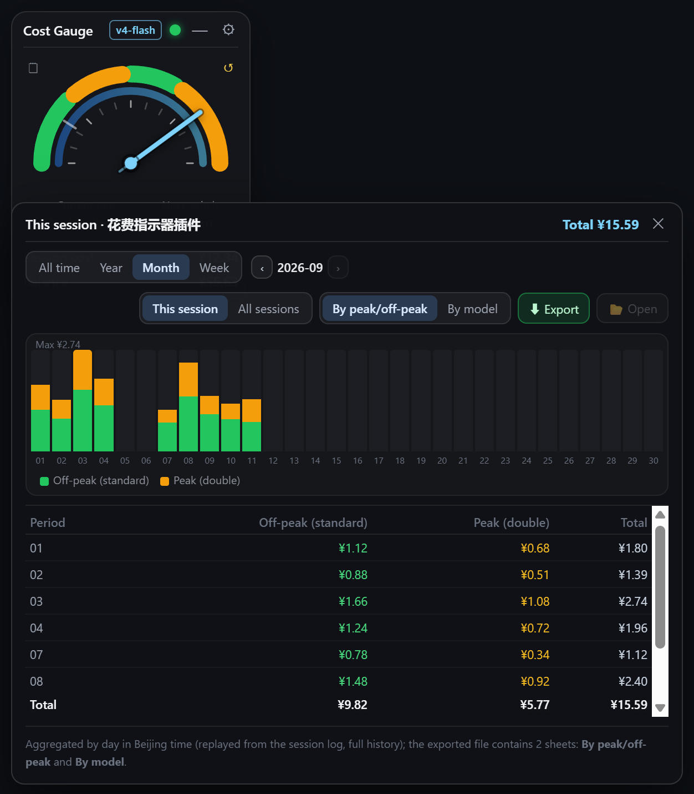
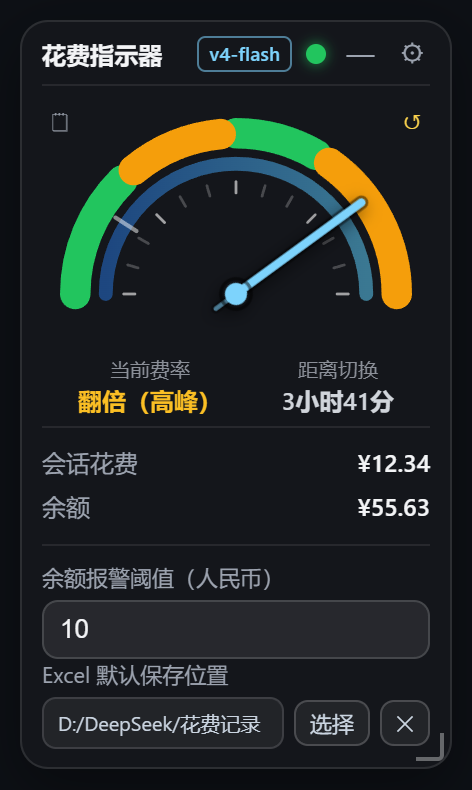
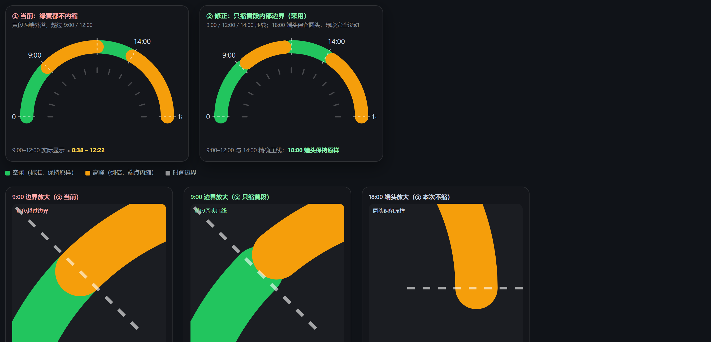

# dsh-cost-gauge

[中文](README.md) | English

A **cost gauge** for DeepSeek Harness (`dsh`): a square floating window at the **upper left** of the Web UI that shows the current session cost and account balance in real time. The **semicircular dial** has a hand that follows Beijing time and arcs colored by the day's rate bands (green = standard, amber = peak, all green on weekends). A red lamp at the top blinks when the balance drops below the threshold. Supports **drag / resize** and **minimize** (status lamp + countdown ring + model badge).

> 🔀 **Related project**: the “minimal-clock / multi-skin” line is maintained separately as **[dsh-cost-gauge-plus](https://github.com/wjingshan/dsh-cost-gauge-plus)**. This repository keeps evolving the **v1.0 classic square gauge**; the two are independent.

## Screenshots

| Expanded | Minimized |
| --- | --- |
|  |  |

## What's new in v1.5.2

| Settings: frost strength / transparency | Before and after (left: off, right: on) |
| --- | --- |
|  |  |

- **Adjustable frost strength and transparency** (two sliders in the settings panel, applied live and remembered):
  - **Frost** `0–24px` — blur radius, higher is hazier (0 keeps only the translucent tint);
  - **Transparency** `0–100%` — higher is more see-through and less milky.
- **The title bar is never frosted**: the frost only applies below it, so the drag handle stays crisp for locating and grabbing the widget.
- **Soft gradient edges instead of a hard line**: the transition width follows the frost strength (5–18px). The hole is built as "horizontal complement ∪ vertical complement" (De Morgan) in the background mask, and the frost layer uses the same shape as its mask, so both fade out together.

## What's new in v1.5.1

| Same spot, side by side: off (left) / frosted (right) |
| --- |
|  |

- **The frost is actually visible now**: the layer used to be just 5% white plus `blur(12px)` — blurring a flat dark chat background yields the same flat dark background, so nothing seemed to change. It is now a **milky gradient + slight brightening + inner hairline** (`blur(9px) saturate(1.2) brightness(1.12)`): measured on the same patch the luminance goes **29 → 83**, while the blurred text behind keeps its structure.
- **Can't find the switch?** While the frost is off, covering the conversation text (overlap ≥ 35% of the widget) now shows a **one-time hint**: enable “Frosted glass over the chat area” in settings.
- **Fixed: the widget could get stuck in the top-left corner** — loading in a minimized window / background tab (viewport 0×0) made the viewport clamp compute a position of (0,0) and persist it; the clamp is now skipped when the viewport is 0.

## What's new in v1.5.0

| Settings: the new “frosted glass over the chat” switch |
| --- |
|  |


- **Auto step-aside when the window is resized**: after you stretch or resize the window, if the widget covers the middle conversation **text column** it moves into the **blank gap between the text column and the sidebar** — centred in that gap and placed in its **lower part** (flush with the bottom of the window; if that would cover the composer it stops 8px above it). Only when the gap is too narrow does it fall back to the sidebar column.
  - Priority: **middle text column (never covered) > bottom composer > sidebars**; ties keep "left stays left, right stays right" with the smallest movement.
  - Triggered only by **window resizes** (150 ms debounce); it never fights a manual drag and is skipped in the narrow strip mode.
  - The gap fits when one side's clearance is ≥ widget width + 16px: at the default 216px that needs a window ≳1658px (middle column ≥ 1378px, sidebar expanded, right bar closed); at the minimum 180px it is about 1458px.
- **Optional frosted glass over the chat** (new setting, **off by default**): when enabled, the part of the widget overlapping the conversation text turns into translucent frosted glass (`backdrop-filter`) so the covered text stays readable — only the genuinely overlapping part is frosted, parking in the blank gap keeps it opaque. Implemented as "punch a hole in the background layer and lay a frost layer over it" (`mask-composite: exclude`).
- **Auto-dock when the sidebar collapses**: when DSH collapses the sidebar (or the viewport is very narrow) the narrow strip docks to the **right of the sidebar**; with the sidebar expanded it docks under the "Sessions / Workspaces" heading, and it returns to its previous spot when narrow mode ends (the dock position is never persisted).
- Narrow strip width 48px → **36px**.
- Internal fix: the "chat content column" used by both behaviours is now derived from `--dsh-chat-content-width` (the centred content band inside the panel) with proper `clamp()/calc()` resolution, falling back to the composer card width and then to the whole middle panel, so the blank gutters are no longer mistaken for conversation content.

## What's new in v1.4.0

| Narrow window → vertical mini |
| --- |
|  |

- **Viewport-aware vertical mini**: a `ResizeObserver` watches the viewport width; at **779px or less** the gauge switches to a 48px-wide **vertical mini** (top to bottom: status lamp → session cost → balance → model badge, rendered vertically) and **expands again on click**. When the window grows back to **860px or more** the previous expanded/collapsed state is restored.
  - **Hysteresis** (enter 780 / exit 860) prevents flicker at the threshold; after you manually expand from the mini strip it stays expanded until the window grows past 860px again.
  - Thresholds can be overridden via `localStorage` keys `dsh-cost-gauge:narrowEnter` / `dsh-cost-gauge:narrowExit`.

## What's new in v1.3.0

| Spend records panel | Settings | Arc cap fix |
| --- | --- | --- |
|  |  |  |

- **Correct cost math**: the host now replays the session log and prices every usage event at “rate at that moment × model at that moment”, so off-peak usage is charged at the off-peak rate and peak usage at the peak rate, then summed. This fixes the old behaviour where entering the peak window re-priced the whole history (cost doubling).
- **New “Records / Reset” icon buttons** (top-left and top-right of the dial; borderless mini icons with hover hints). The records panel offers `All time / Year / Month / Week` filtering and paging, a **stacked bar chart** (by band or by model) and a detail table that lists **only periods with usage**. Scope switches between `This session` and `All sessions`. The panel is draggable, may cover the gauge, and is pulled back inside the window when out of bounds. Reset is a two-step confirmation that moves the baseline and restarts from ¥0.00 (history is kept).
- **Excel export is now a real `.xlsx`** (OOXML; hand-written minimal zip writer, no dependencies; opens in Excel/WPS with no format warning): two worksheets plus a note row, and **default file name `<session name>_<start>-<end>.xlsx`**. A default save folder can be configured in Settings (exports then write directly with no dialog); `📂 Open` reveals the file in Explorer.
- **Host-side accounting**: the session event log is replayed every 15 s and persisted to `~/.dsh/cost-gauge/ledger.json`, so accounting continues while the dashboard is closed and records cover the session's full history.
- **Dial arc cap fix**: peak (amber) segments are inset by the round-cap radius (5.43°) at interior boundaries (9:00 / 12:00 / 14:00) so the cap's outer edge lands exactly on the boundary instead of covering the neighbouring green segment; the 18:00 end keeps its original rounded look.
- **Bilingual UI**: follows the DSH client language setting, falling back to the system/browser language (`zh*` → Chinese, otherwise English).

## Features

- 🔲 **Floating window** — sits near the upper left by default, drag it by the title bar; the position is remembered.
- 📱 **Viewport-aware** — when the viewport gets narrow (≤ 779px) the gauge collapses into a **36px vertical mini** (lamp + cost + balance + model badge); click to expand, and it restores automatically at 860px or more. If DSH auto-collapses the sidebar the strip docks to its right, and with the sidebar expanded it docks under the “Sessions / Workspaces” heading.
- 🪟 **Auto step-aside** — on window resizes, a widget covering the conversation text moves into the blank gap between the text column and the sidebar (centred, lower part); priority is text column > composer > sidebars.
- 🧊 **Frosted glass over the chat** (setting, off by default) — the overlapping strip of the widget turns translucent so the text underneath stays readable.
- 💰 **Session cost** — token usage priced with the official peak/off-peak rates (cache miss / cache hit / output priced separately).
  - **Per-event pricing**: usage produced during off-peak hours is charged at the off-peak rate and usage produced during peak hours at the peak rate, then summed. Entering the peak window does **not** re-price earlier off-peak usage.
- 🧭 **Rate hand** — the dial shows the current rate band and the countdown to the next switch.
  - Peak (doubled): Mon–Fri 09:00–12:00 and 14:00–18:00 Beijing time
  - Off-peak (standard): all remaining hours, including the whole weekend; half the peak price
- 🔴 **Low-balance alarm** — the top lamp blinks red when the balance is below the threshold (default ¥10), green otherwise.
- ⚙️ **Configurable threshold** — click the gear to change the alert threshold; it takes effect immediately and is remembered (localStorage).
- 🗒 **Spend records** (top-left icon on the dial) — a wide panel with **All time / Year / Month / Week** range filtering and paging, a **stacked bar chart** (by peak/off-peak or by model), a detail table and totals. Scope can be switched between **This session** and **All sessions**; the detail table lists only periods that **have usage records** (the chart keeps the full timeline). The panel can be dragged, may cover the gauge, and is automatically pulled back inside the window when it would go out of bounds.
- ⬇ **Export to Excel** — exports the current range as a **real `.xlsx`** (OOXML; a hand-written minimal zip writer, no third-party dependencies; opens directly in Excel/WPS with no format warning). The workbook contains **two worksheets**: `By peak/off-peak` and `By model`; the first row of both sheets is an export note (session name, billing period, range filter, last reset, export time). **Default file name = `<session name>_<start>-<end>.xlsx`** (e.g. `花费指示器插件_20260808-20260911.xlsx`; for all sessions `All sessions_...`). After a successful export, `📂 Open` reveals the file in Explorer.
- 📁 **Default save folder** — once a folder is configured in Settings, exports are written **directly with no dialog**; when unset, a native folder picker appears and the chosen folder becomes the default (preferences persist in `~/.dsh/cost-gauge/ledger.json`).
- ↺ **Reset session cost** (top-right icon on the dial) — after a two-step confirmation the current total becomes the baseline and the counter restarts from ¥0.00 (history is not deleted).
- 🧮 **Host-side accounting (log replay)** — every 15 s the host replays each session's **event log** (`assistant/message` / `assistant/attempt` carry usage and a timestamp; `request/header` provides the model in force) and books each entry at “rate at that moment × model at that moment” into “day × band × model”, persisted to `~/.dsh/cost-gauge/ledger.json`. `llm/retry-started` and repeated samples for the same turn/step **replace** rather than accumulate, matching the official projection. Accounting therefore continues while the dashboard page is closed, and records cover the session log's **full history** (not just since installation).
- 🌐 **Bilingual UI** — the plugin follows the DSH client language (Settings → General), and falls back to the system/browser language: Chinese when it starts with `zh`, otherwise English.

## Install

### One-liner (recommended, no git needed)

Paste into PowerShell and press Enter (it adds `dsh` automatically):

```powershell
irm https://raw.githubusercontent.com/wjingshan/dsh-cost-gauge/main/install.ps1 | iex
```

> The one-liner installs the **latest stable Release tag** automatically. To install the development version or pin a tag, download the script first:

```powershell
irm https://raw.githubusercontent.com/wjingshan/dsh-cost-gauge/main/install.ps1 -OutFile install-dsh-cost-gauge.ps1
.\install-dsh-cost-gauge.ps1 -Ref main        # development (main)
.\install-dsh-cost-gauge.ps1 -Ref v1.5.0      # pin a tag
```

### Manual install

```sh
# from git (requires git on this machine)
dsh plugin --profile web add github:wjingshan/dsh-cost-gauge#main
dsh plugin --profile web add github:wjingshan/dsh-cost-gauge#v1.5.0

# tarball, no git required
dsh plugin --profile web add https://github.com/wjingshan/dsh-cost-gauge/archive/refs/tags/v1.5.0.tar.gz

# local directory (linked; edits to lib/*.js take effect after a page refresh)
dsh plugin --profile web add link:/path/to/dsh-cost-gauge
```

After installing, **restart** `dsh web` and refresh the page:

```sh
dsh web
```

## Configuration

The balance threshold can be changed from the gear in the floating window or overridden in the profile's `cordis.patch.yml`:

```yaml
- update:
    - id: cost-gauge
      config:
        threshold: 10          # balance alert threshold (CNY)
        baseUrl: 'https://api.deepseek.com'
        apiKeyEnv: 'DEEPSEEK_API_KEY'
        refreshSeconds: 30     # balance query cache, seconds
```

> A patch replaces a row's whole `config` object, so restate every key you need.

## API

| Endpoint | Purpose |
| --- | --- |
| `GET  /api/cost-gauge/state?session=<id>` | balance + session cost (since last reset) + rate + threshold |
| `GET  /api/cost-gauge/balance` / `GET /api/cost-gauge/refresh` | balance view / force refresh |
| `GET  /api/cost-gauge/records?session=<id>&scope=session\|all` | daily records for one session or merged across sessions |
| `POST /api/cost-gauge/reset` | reset the session cost baseline |
| `GET/POST /api/cost-gauge/prefs` | read / write export preferences (default folder) |
| `POST /api/cost-gauge/pick-folder` | native folder picker, saved as the default |
| `POST /api/cost-gauge/export` | write the `.xlsx` (two worksheets) into the configured folder |
| `POST /api/cost-gauge/open-folder` | reveal the most recent export in Explorer |

## Data & security

- The balance is read through the official `GET /user/balance`; the API key is resolved on the host only (credentials seam / environment variable) and is **never sent to the browser**.
- Cost comes from replaying the session event log on the host with the official peak/off-peak rates; cache writes are not billed separately (matching the official rule).
- Pure ESM, no third-party runtime dependencies: the host uses Node built-ins only, the browser half is plain JavaScript (no React).

## Directory layout

```
dsh-cost-gauge/
├── package.json          # dsh.bundle (host) + dsh.client (browser) declarations
├── cordis.patch.yml      # plugin row (with default config)
├── install.ps1           # one-liner installer
├── release.ps1           # commit + bump + push + GitHub Release
├── docs/                 # screenshots, preview pages, Alipay QR
├── lib/
│   ├── index.js          # host: balance, accounting, rate, /api/cost-gauge/* routes
│   ├── ledger.js         # host: log replay accounting, ledger persistence, xlsx writer
│   └── client.js         # browser: floating gauge + records panel (bilingual)
└── README.md / README.en.md
```

## Release

```powershell
.\release.ps1 -Type minor -Message "feat: ..."   # or -Version 1.3.0
```

Creating the GitHub Release needs a PAT (`GH_TOKEN`, fine-grained with Contents read/write) or an interactive prompt. `install.ps1` always picks the latest Release tag, so no script changes are needed per release.

## License

MIT

---

## ☕ Sponsor

If this plugin helps you, you are welcome to buy me a coffee ☕


<div align="center">

**Thanks for your support!** 💙

</div>
