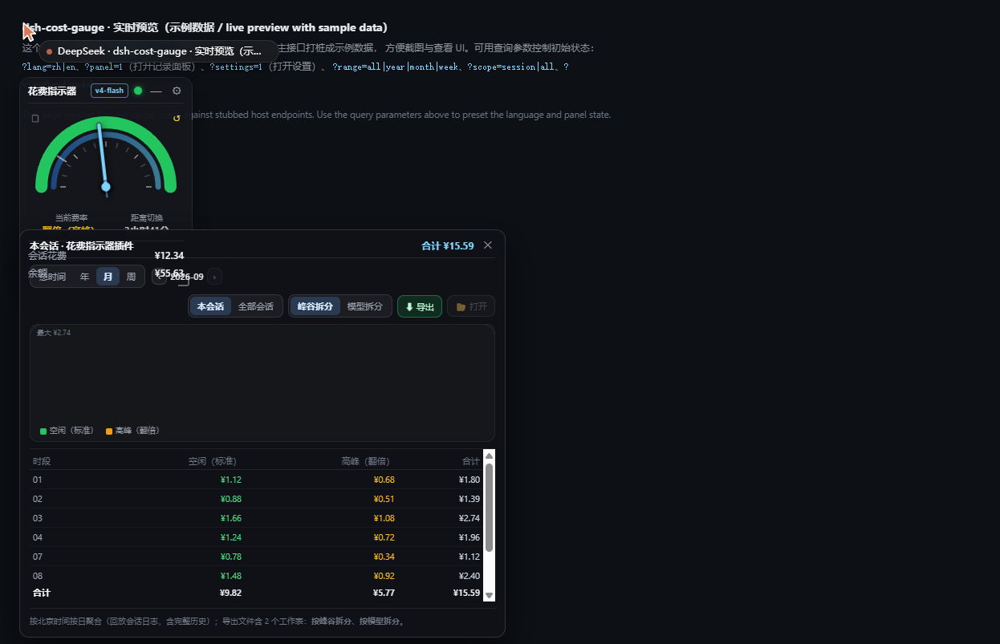
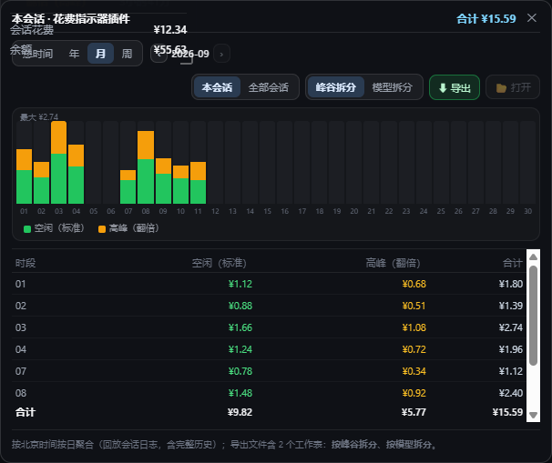
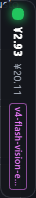
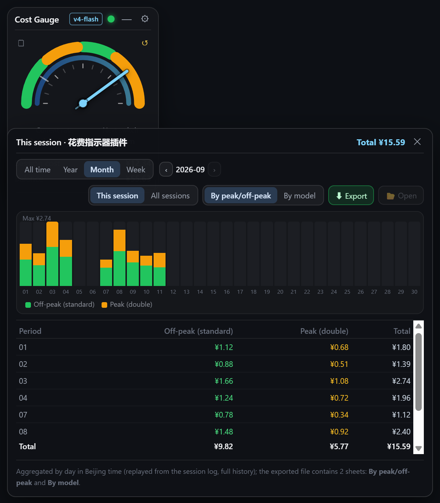

# dsh-cost-gauge

[中文](README.md) | English

A **cost gauge** for DeepSeek Harness (`dsh`): a square floating window at the **upper left** of the Web UI that shows the current session cost and account balance in real time. The **semicircular dial** has a hand that follows Beijing time and arcs colored by the day's rate bands (green = standard, amber = peak, all green on weekends and public holidays). A red lamp at the top blinks when the balance drops below the threshold. Supports **drag / resize**, **minimize** (status lamp + countdown ring + model badge) and **edge snapping** (drag the widget to the left or right edge of the app window and it docks as a thin vertical strip).

> 🔀 **Related project**: the “minimal-clock / multi-skin” line is maintained separately as **[dsh-cost-gauge-plus](https://github.com/wjingshan/dsh-cost-gauge-plus)**. This repository keeps evolving the **v1.0 classic square gauge**; the two are independent.

## Screenshots

| Expanded | Minimized | Public holiday |
| --- | --- | --- |
|  |  |  |

> Left: expanded (weekday peak — green/amber arcs, amber = peak band; the bottom three rows are turn cost / session cost / balance); middle: minimized (rate lamp + countdown ring + cost/balance + model badge); right: a **public holiday** (Mid-Autumn, 9-25) — the whole arc is green and the status reads "Standard (Mid-Autumn Festival)".

## What's new in v1.6.1 – v1.6.8

> Six batches: **v1.6.8** adds the **turn cost** and lets you switch what the compact states show; **v1.6.7** fixes the widget being **unclickable and undraggable in the desktop app** (Electron swallowed the top strip’s mouse input as window dragging); **v1.6.6** brings back the **bar chart in the cost records panel** (buried by the glass backdrop layer since v1.6.0); **v1.6.5** slims down the **minimized capsule**; **v1.6.4** adds **edge snapping (dock as a vertical strip)**; **v1.6.1 – v1.6.3** was one round of **dsh 0.1.7** compatibility work — **compatibility**, **holiday display**, and the **cost display fix**.

| Version | Theme | In one line |
| --- | --- | --- |
| **v1.6.8** | 🧮 Turn cost | The expanded view gains a **turn cost** row (current turn only, under one cent shows `<0.01`); the minimized capsule and the docked strip can be switched between turn cost and session cost in settings |
| **v1.6.7** | 🖱 Interactive in the desktop app | The DSH desktop shell lays a window-drag hot zone across the top of the window with `-webkit-app-region:drag`; a widget parked there has its mouse input consumed as window dragging — unclickable, undraggable |
| **v1.6.6** | 📊 Bar chart regression | The glass backdrop layer and the chart's bars shared the class name `.dsg-bar`: the bars inherited `position:absolute; inset:0`, so 30 of them covered the whole chart area and the last, empty one hid all the others |
| **v1.6.5** | 📏 Slimmer minimized capsule | Minimized size halved and the width now fits its content; the badge's slot class was being wiped by `setModelBadge`, which is why the right side had a blank gap |
| **v1.6.4** | 🧲 Edge snapping | Drag the widget to the left or right edge and it snaps into a **docked vertical strip**; click it or drag it away to restore |
| **v1.6.3** | 💰 Cost display fix | 0.1.7 moved “which session is selected” out of the client `sessions` service, so the cost and the model badge stuck at `—`; now resolved from several sources |
| **v1.6.2** | 🗓 Holiday display | Chinese statutory holidays (and weekend make-up workdays) are billed off-peak: all-green dial, switch instants that skip holidays, and status text that says why |
| **v1.6.1** | 🧩 Compatibility | 0.1.7 dropped `data-dsh-frame` from the app frame — conversation-area geometry and sidebar-collapse detection broke; the frame is now derived by walking up from the columns |

### v1.6.8 · Turn cost + a switchable compact display

**New: the expanded view gains a “Turn cost” row, and the minimized capsule / docked strip can show either the turn cost or the session cost.**

- **Turn cost** — counts the current turn only. On `turn/start` the host resets it to zero and accumulates every charge of that turn from there.
- **Same pricing path as the session cost** — every event is priced at the rate and model in effect at its own timestamp (the exact same `priceAt` call the session cost uses), so the two numbers can never disagree in method.
- **Under one cent shows `<0.01`**, so you never get a column of `¥0.00`. The session-cost row keeps its original `¥X.XX` format.
- **Compact states are a choice** — a new setting, **“Show turn cost in the minimized capsule and strip”**, is off by default, which keeps the previous behaviour (both show the **session cost**). Both compact states follow it together, and hovering the number tells you which one you are looking at.
- **The manual reset is independent** — “Reset session cost” only touches the session cost; the turn cost is unaffected.
- **Replacement and retries are handled** — a repeated sample for the same `turn/step` replaces rather than accumulates (the official projection semantics), and `llm/retry-started` rollbacks are subtracted from the turn cost too.

| State | Shows |
| --- | --- |
| Expanded | Turn cost / session cost / balance — three rows |
| Minimized capsule, setting off (default) | Session cost |
| Minimized capsule, setting on | Turn cost |
| Docked strip | Always matches the minimized capsule |
| Turn cost below ¥0.01 | `<0.01` |

> The **host half** (turn accounting) and the **client half** (the new row and the setting) changed independently. The host half is pinned by DSH’s module cache, so it **needs a DSH restart**; the client half only needs a page refresh.

### v1.6.7 · Unclickable and undraggable in the desktop app (Electron read the mouse as window dragging)

**Fix: in the DSH desktop app (Electron, 0.2), a widget parked at the very top of the window could not be expanded by clicking, and dragging it dragged the whole application window instead.**

The desktop shell lays a **window-drag hot zone** across the top of the window:

```css
[data-windows-titlebar] .frame:before{inset:0 0 auto;
  height:var(--dsh-windows-titlebar-height);-webkit-app-region:drag}
```

Chromium treats that band as the window title bar: **mouse input landing inside it is handed to the OS for window dragging and never delivered to the page**. The widget position lives in `dsh-cost-gauge:pos`, and dragging it to the top clamps it to `y = 8` — the whole minimized capsule sat inside that band, so clicks never arrived (nothing expanded) and drags moved the window.

A plain browser (`dsh web`) has no app-region concept and uses ordinary DOM hit-testing, which is why this only ever showed up in the desktop app.

- Added `-webkit-app-region:no-drag;app-region:no-drag;` to `.dsg-root` and `.dsg-records`, carving the widget's own rectangle out of the hot zone.
- The precedent is upstream's own: DSH's `position:fixed` sidebar toggle carries `-webkit-app-region:no-drag` for exactly this reason — a fixed element sitting over the hot zone has to declare `no-drag` itself.

> Pure CSS, client half only — **no DSH restart needed**. The bundle gets a new rev, so **refresh the page once**. Verified against the running desktop host: the old rev returns 404 while the recomposed rev returns 200 carrying both declarations.

### v1.6.6 · The bar chart was buried by the backdrop layer (class-name collision)

**Fix: ever since v1.6.0 the cost records panel's bar chart showed nothing but “最大 ¥…” and the legend — all the bars were gone.**

 

The root cause is **two different things sharing one class name**: the chart's bars (added in v1.3.0) are `.dsg-bar`, and the **backdrop layer** that the glass redesign (v1.6.0) puts behind the title bar and the bottom row is *also* `.dsg-bar`:

```css
/* v1.6.0 backdrop layer (only shown while frosting is on) */
.dsg-bar{position:absolute;inset:0;z-index:1;display:none;pointer-events:none;background:rgba(20,22,28,1); …}
/* v1.3.0 chart bar: later in the sheet, but it only declares a few properties */
.dsg-bar{flex:1;min-width:0;height:100%;display:flex;flex-direction:column;justify-content:flex-end}
```

The later rule wins only for `display` / `height` / `flex`, so the bars **inherited** `position:absolute; inset:0; z-index:1; pointer-events:none` from the backdrop — **each of the 30 bars ended up covering the entire chart area**, later ones painting over earlier ones, and the last day (no usage, no segments) had an opaque background that wiped out everything in front of it. `pointer-events:none` came along too, which is why the bars could not even be hit with the mouse (`document.elementFromPoint` returned the container instead of a bar).

- **Scoped the backdrop to direct children**: `.dsg-root>.dsg-bar{…}` and `.dsg-root.dsg-frosting>.dsg-bar{display:block}`. The backdrop already *is* a direct child of `.dsg-root` (in the markup `<div class="dsg-bar">` sits next to `.dsg-bg` and `.dsg-frost`), while the chart bars are descendants — the two can no longer touch each other.
- Added a **comment** above that rule about the collision, so nobody writes another bare `.dsg-bar` rule.

| Case | Before | After |
| --- | --- | --- |
| The panel's bar chart | an empty dark rectangle (just the max label + legend) | 30 stacked bars + day labels + legend |
| Chart bar positioning | `position:absolute`, opaque background | `position:static`, transparent background |
| Glass backdrop layer | `display:block` / `absolute` / `z-index:1` / `rgb(20,22,28)` | unchanged |

> A pure CSS change — **two selectors** — verified both in the project's live preview page (`docs/preview-live.html?panel=1&range=month&view=band`, which loads the same `lib/client.js`) and in the real GUI.

### v1.6.5 · Slimmer minimized capsule

**Fix + polish: the minimized state always had a blank gap on the right; the whole thing is now half the size.**

The minimized widget used to be a **210×58** capsule, and as soon as the model name was short (say `flash`) it left sixty-odd pixels of empty space on the right. The root cause was not the size but the badge — `setModelBadge()` rewrote `className` wholesale every time:

```js
el.className = 'dsg-badge' + (cls ? ' ' + cls : '')
```

That wiped the slot class `dsg-mini-badge`, so `.dsg-mini-badge{margin-left:auto}` **never applied**; and since the width was hard-coded to `MINI_W = 210`, whatever was left over stayed as blank space. (The docked strip's badge only survived because one line re-added `classList.add('dsg-narrow-badge')`.)

- **The badge slot is now a parameter**: `setModelBadge(el, modelRaw, slot)`, with the three call sites passing `undefined` / `'dsg-mini-badge'` / `'dsg-narrow-badge'`; that ad-hoc patch line is gone.
- **The width now fits its content**: the minimized state sets `width:auto` **and** turns off `container-type`. `.dsg-root` carries `container-type:inline-size`, so it is an inline-size container whose intrinsic width ignores its contents — **`width:auto` alone collapses it to 22px** (measured).
- **Half the size throughout**: status lamp 40 → 20px, main figure 14 → 12px, balance 11 → 10px, padding 8px/10px → 3px/7px.
- **Badge font is now a fixed `9px`** (there is no container in the minimized state, so `cqw` would fall back to the viewport) and capped at `44px` wide, with long model names truncated by ellipsis.

| Case | Before | After |
| --- | --- | --- |
| Long model name `v4-flash-vision-exp` | 210×58 | **135×34** |
| Short model name `flash` | 210×58 (~62px of blank space) | **111×34** (no gap) |

> Neither the expanded state nor the docked strip was affected (measured in the live GUI: expanded is still 216×265 and the strip is still 36×198). This is a **front-end only** change as well.

### v1.6.4 · Edge snapping (docked strip)

**New: drag the widget to the edge of the app window and it snaps to that edge; on the left or right edge it also turns into a vertical strip.**



- **Magnetic preview while dragging**: once the pointer is within **24px** of an edge the widget is pulled to it and only settles there when you let go — no guessing whether it will snap.
- **Left / right edge → vertical strip**: on release it becomes a **36px-wide** strip docked to that edge, stacked top to bottom: status lamp, session cost, balance and model badge. Its **vertical position** stays wherever you dropped it.
- **Top / bottom edge → edge only, no reshape**: top and bottom just snap (a horizontal strip would make no sense).
- **Corners count as left/right**: dropping in a corner is handled as the left or right edge — only those two reshape into a strip.
- **Getting out is easy**: click the strip to expand it in place, back at **the position it had before you dragged it**; or drag the strip toward the middle of the window and it undocks and expands right there.
- **Persisted**: which edge it is docked to, how far down, and where it used to be all live in `localStorage` (`dsh-cost-gauge:dock` / `dsh-cost-gauge:pos`), so a page refresh restores it.
- **Can be turned off**: the settings panel has a new **Edge snapping** switch (on by default); the snap distance can be overridden with `dsh-cost-gauge:snapDist`.

> This is not the same as the **vertical mini** mode from v1.4.0: that one is triggered by **window width** (a narrow window collapses the widget), while this one is triggered by **position** — even a very wide window snaps when you drag the widget to the edge.
> This feature is **front-end only**; the host half (`lib/index.js` / `lib/ledger.js`) was not touched.

### v1.6.3 · Cost display fix

**Fixed: the session cost and the model badge stopped rendering** (since dsh 0.1.7; the header showed nothing but `—`).

dsh 0.1.7 moved "**which session is currently selected**" **out of** the client-side `sessions` service: the list snapshot of `dsh-api-session-controller` now holds only `ids / byId / phase / projectionsBySession` — **there is no `current` field** (the file's own comment says *"Host catalog and local reference allocator; **view selection remains outside the Controller**"*). The selection is now kept **privately** by `dsh-client-ui-workspace` and is **not** provided as a service (0.1.7's client exposes just eight services: `sessions` / `layout` / `resources` / `modules` / `documentPreviews` / `uiRenderer` / `sidebarRightTabs` / `sidebarRight`), so a plugin cannot inject it.

The plugin used to read `ctx.sessions.list.getSnapshot().current`, which is now always `undefined` — so the request degraded to one **without `?session=`**, the host returned only the rate and balance, and the header could show nothing but `—`.

- **Now resolved from several sources** (new `currentSessionId()`, tried in order of reliability, first hit wins):
  1. `localStorage['dsh.sessions.current']` — the selection **dsh itself** persists (shaped `{ sessionId }`). `dsh-client-store`'s `attachPersistence` writes it back **synchronously** on every state change, so it is a live signal, not a stale cache.
  2. `[data-sidebar-right-session]:not([hidden])` — the rightbar's current-session element, also written by dsh itself.
  3. The old snapshot's `.current` — for **0.1.6 and earlier**.
- **All three call sites unified**: polling, the working lamp, and the records panel/export each read `.current` separately; they now all go through `currentSessionId()`.
- **The "working lamp" is fixed too**: `isSessionRunning()` depended on `.current` as well, so the header lamp glow and the minimised blinking for "session running" **had been broken all along** (it never lit).

### v1.6.2 · Holiday display

**Holiday pricing**: Chinese statutory holidays (including make-up workdays) are **billed at the off-peak rate**. Until now the dial judged by **weekday only**, so a holiday landing on a Monday-to-Friday was wrongly shown as **standard/peak**.

- **New `lib/holidays.js`** carrying the **2026** State Council holiday schedule (New Year / Spring Festival / Qingming / Labour Day / Dragon Boat / Mid-Autumn / National Day), distinguishing **statutory holidays** from **weekend make-up workdays** (e.g. Sun 9-20 and Sat 10-10 are normal working days).
- **All-green dial on holidays**: on a holiday (**even a weekday**) the whole arc is green, exactly like a weekend — no amber peak band. This matches the official "holidays are billed off-peak" rule.
- **Rate-switch instants carry over**: the countdown no longer simply jumps to the next 9:00 / 12:00 / 14:00 / 18:00 — it **skips holidays and weekends**. For example 18:30 on the day before Mid-Autumn carries all the way to **Mon 9-28 09:00**, and 19:00 before National Day carries to **10-08 (Thu) 09:00**. The off-peak stretch length driving the countdown ring follows the same rule, so the ring's proportion stays correct.
- **The status text now explains itself**: "standard" on a weekday daytime used to contradict the amber band on the dial. It now reads `Standard (Mid-Autumn Festival)` / `Standard (make-up workday)` / `Standard (off-peak)`.
- **Data-coverage hint**: the settings panel's version line shows `Holiday data: 2026 (State Council notices)`. For a year that is not covered the rate **falls back to weekday-only** and the line turns amber: `⚠ No holiday data for 2027; rate falls back to weekday only`.

> When the 2027 schedule is published, just add one more year table to `lib/holidays.js`; `coveredYears()` picks the new year up in that hint automatically.

### v1.6.1 · Compatibility

Compatibility with **dsh 0.1.7**. That release **removed the `data-dsh-frame` attribute** from the three-column app frame — the frame now only carries *conditional* attributes (`data-sidebar-collapsed` / `data-rightbar-collapsed` / `data-panel-conversation`) that are not rendered at all when false, so the main frame can no longer be selected directly.

- **Fixed: wrong conversation-area geometry** (verified by measurement). `getChatAreaRect()` used to take the frame via `[data-dsh-frame]` and then pick the middle conversation column from its direct children. Under 0.1.7 that attribute is gone, so the function **silently degraded to a global `scrollBody` search**: it measured **998×732**, whereas the real middle column is **1000×808** (76px too short), and its internal `chatPanelEl` stayed `null` — so later lookups for `scrollBody` / the input card were **no longer scoped to the middle column**. This also skewed the glass effect's "overlaps the conversation area" test and the content-band alignment. It now resolves the frame through the new `getFrameEl()` and correctly selects `centerCol`.
- **Fixed: sidebar collapse detection.** The collapse signal is now read from `data-sidebar-collapsed` on the frame (`getFrameEl()` tries the legacy attribute first for 0.1.6 and older, then derives the frame by walking **up from the sidebar / center / right column**). The width fallback changed from `w > 0 && w <= 96` to "**frame is laid out** + column width ≤ 96px": in Windows titlebar mode a collapsed column is **0** wide (the whole column is 0×0, which the width fallback cannot see) and the old check missed it; the layout check distinguishes "really collapsed" from "first frame, not laid out yet".
- **Corrected a manifest field**: `dsh.client.inject` declared `@deepseek-ai/dsh-client-runtime`, which no longer exists in the new dependency tree; it now names `@deepseek-ai/dsh-api-session-controller`, the package that actually provides the client-side `sessions` service. The field is only an **informational** dependency (`dsh-client-modules` silently ignores unknown packages), so the stale value never errored — it was just outdated.

> The host-side accounting (session event reading, V4 session format, model pricing) was checked and **needs no change**: 0.1.7's `dsh-token-meter` extracts usage the same way this plugin does, and the model catalog is still `deepseek-flash` (V4.1-Flash) and `deepseek-v4-pro`.

## What's new in v1.6.0

| Before / after (left: off · right: on — only the part over the chat text changes) |
| --- |
|  |

- **A new glass treatment**: the part of the widget reaching into the conversation **content column** turns into **grey glass**:
  - **title bar / bottom cost & balance rows**: slightly transparent (adjustable);
  - **the middle background**: fully transparent — the blurred conversation shows through;
  - **the dial and text in the middle**: keep only their **lightness** (hue and saturation dropped = greyscale), and **each colour's opacity equals its lightness** (lightness 80 → opacity 80%), so different colours end up differently transparent.
- **Only the overlapping rectangle is affected**: whatever has not entered the chat column stays exactly as it was (even the dial keeps its colours). Implemented by clipping inside the SVG filter — the transformed result inside the hole and the original outside, feathered by the **Edge fade** setting.
- **Six settings** (all live and remembered):

  | Setting | Range | Default | Meaning |
  | --- | --- | --- | --- |
  | Frost | 0–24px | 9px | blur radius |
  | Transparency | 0–100% | 47% | density of the milky veil in the middle |
  | Edge fade | 0–40px | 14px | transition width between the normal and the glass area (0 = hard edge) |
  | Bar fade | 0–60% | 15% | transparency of the title bar and the bottom rows (**0% = fully opaque**) |
  | Content opacity | 0–100% | 100% | multiplier on top of lightness: 100% = strictly by lightness, 0% = invisible (linear, every step does something) |
  | Lightness | Rec.709 / HSL / HSV | Rec.709 | which lightness defines the greyscale and the opacity |
- **Fixed**: changing *Content opacity* or switching *Lightness* rebuilt the filter and reset the hole rectangle, so the transform vanished until the next tick (it felt like the slider did nothing). It now applies immediately — and the range was narrowed from 0–200% to **0–100%**.

## What's new in v1.5.3

- **Fixed: session spend could stop updating (out-of-range ledger cursor)**: after a session log is compacted or rewritten its seq space shrinks, while the persisted `cursor` stays in the old space — so `snapshotEvents(cursor, log end)` returns an empty array forever and new events are never folded in (session spend freezes, or stays at ¥0.00 after a reset). The session's ledger entry is now rebuilt from the current log whenever `cursor > session.seq`.
- **Fixed: the dial hand ran backwards after midnight**: the 00:00–06:00 branch of `dialPosOfHour()` had the wrong direction (`90 - 15t`), so the hand turned back after reaching the top. Both halves now sweep left → top → right: night **18:00 left → 24:00 top → 06:00 right**, day 06:00 left → 12:00 top → 18:00 right, with instant jumps at 06:00 and 18:00.
- **Version shown at the bottom of the settings panel**: the host returns `version` (read from `package.json`) in `/state`, and the settings panel shows `dsh-cost-gauge vX.Y.Z` in 10px muted text; the row hides itself when no version is available.

## What's new in v1.5.2

| Settings: frost strength / transparency | Before and after (left: off, right: on) |
| --- | --- |
|  |  |

- **Adjustable frost strength and transparency** (two sliders in the settings panel, applied live and remembered):
  - **Frost** `0–24px` — blur radius, higher is hazier (0 keeps only the translucent tint);
  - **Transparency** `0–100%` — higher is more see-through and less milky.
- **The title bar is never frosted**: the frost only applies below it, so the drag handle stays crisp for locating and grabbing the widget.
- **Soft gradient edges instead of a hard line**: the transition width follows the frost strength (5–18px). The hole is built as "horizontal complement ∪ vertical complement" (De Morgan) in the background mask, and the frost layer uses the same shape as its mask, so both fade out together.

## What's new in v1.5.1

| Same spot, side by side: off (left) / frosted (right) |
| --- |
|  |

- **The frost is actually visible now**: the layer used to be just 5% white plus `blur(12px)` — blurring a flat dark chat background yields the same flat dark background, so nothing seemed to change. It is now a **milky gradient + slight brightening + inner hairline** (`blur(9px) saturate(1.2) brightness(1.12)`): measured on the same patch the luminance goes **29 → 83**, while the blurred text behind keeps its structure.
- **Can't find the switch?** While the frost is off, covering the conversation text (overlap ≥ 35% of the widget) now shows a **one-time hint**: enable “Frosted glass over the chat area” in settings.
- **Fixed: the widget could get stuck in the top-left corner** — loading in a minimized window / background tab (viewport 0×0) made the viewport clamp compute a position of (0,0) and persist it; the clamp is now skipped when the viewport is 0.

## What's new in v1.5.0

| Settings: the new “frosted glass over the chat” switch |
| --- |
|  |


- **Auto step-aside when the window is resized**: after you stretch or resize the window, if the widget covers the middle conversation **text column** it moves into the **blank gap between the text column and the sidebar** — centred in that gap and placed in its **lower part** (flush with the bottom of the window; if that would cover the composer it stops 8px above it). Only when the gap is too narrow does it fall back to the sidebar column.
  - Priority: **middle text column (never covered) > bottom composer > sidebars**; ties keep "left stays left, right stays right" with the smallest movement.
  - Triggered only by **window resizes** (150 ms debounce); it never fights a manual drag and is skipped in the narrow strip mode.
  - The gap fits when one side's clearance is ≥ widget width + 16px: at the default 216px that needs a window ≳1658px (middle column ≥ 1378px, sidebar expanded, right bar closed); at the minimum 180px it is about 1458px.
- **Optional frosted glass over the chat** (new setting, **off by default**): when enabled, the part of the widget overlapping the conversation text turns into translucent frosted glass (`backdrop-filter`) so the covered text stays readable — only the genuinely overlapping part is frosted, parking in the blank gap keeps it opaque. Implemented as "punch a hole in the background layer and lay a frost layer over it" (`mask-composite: exclude`).
- **Auto-dock when the sidebar collapses**: when DSH collapses the sidebar (or the viewport is very narrow) the narrow strip docks to the **right of the sidebar**; with the sidebar expanded it docks under the "Sessions / Workspaces" heading, and it returns to its previous spot when narrow mode ends (the dock position is never persisted).
- Narrow strip width 48px → **36px**.
- Internal fix: the "chat content column" used by both behaviours is now derived from `--dsh-chat-content-width` (the centred content band inside the panel) with proper `clamp()/calc()` resolution, falling back to the composer card width and then to the whole middle panel, so the blank gutters are no longer mistaken for conversation content.

## What's new in v1.4.0

| Narrow window → vertical mini |
| --- |
|  |

- **Viewport-aware vertical mini**: a `ResizeObserver` watches the viewport width; at **779px or less** the gauge switches to a 48px-wide **vertical mini** (top to bottom: status lamp → session cost → balance → model badge, rendered vertically) and **expands again on click**. When the window grows back to **860px or more** the previous expanded/collapsed state is restored.
  - **Hysteresis** (enter 780 / exit 860) prevents flicker at the threshold; after you manually expand from the mini strip it stays expanded until the window grows past 860px again.
  - Thresholds can be overridden via `localStorage` keys `dsh-cost-gauge:narrowEnter` / `dsh-cost-gauge:narrowExit`.

## What's new in v1.3.0

| Spend records panel | Settings | Arc cap fix |
| --- | --- | --- |
|  |  |  |

- **Correct cost math**: the host now replays the session log and prices every usage event at “rate at that moment × model at that moment”, so off-peak usage is charged at the off-peak rate and peak usage at the peak rate, then summed. This fixes the old behaviour where entering the peak window re-priced the whole history (cost doubling).
- **New “Records / Reset” icon buttons** (top-left and top-right of the dial; borderless mini icons with hover hints). The records panel offers `All time / Year / Month / Week` filtering and paging, a **stacked bar chart** (by band or by model) and a detail table that lists **only periods with usage**. Scope switches between `This session` and `All sessions`. The panel is draggable, may cover the gauge, and is pulled back inside the window when out of bounds. Reset is a two-step confirmation that moves the baseline and restarts from ¥0.00 (history is kept).
- **Excel export is now a real `.xlsx`** (OOXML; hand-written minimal zip writer, no dependencies; opens in Excel/WPS with no format warning): two worksheets plus a note row, and **default file name `<session name>_<start>-<end>.xlsx`**. A default save folder can be configured in Settings (exports then write directly with no dialog); `📂 Open` reveals the file in Explorer.
- **Host-side accounting**: the session event log is replayed every 15 s and persisted to `~/.dsh/cost-gauge/ledger.json`, so accounting continues while the dashboard is closed and records cover the session's full history.
- **Dial arc cap fix**: peak (amber) segments are inset by the round-cap radius (5.43°) at interior boundaries (9:00 / 12:00 / 14:00) so the cap's outer edge lands exactly on the boundary instead of covering the neighbouring green segment; the 18:00 end keeps its original rounded look.
- **Bilingual UI**: follows the DSH client language setting, falling back to the system/browser language (`zh*` → Chinese, otherwise English).

## Features

- 🔲 **Floating window** — sits near the upper left by default, drag it by the title bar; the position is remembered.
- 📱 **Viewport-aware** — when the viewport gets narrow (≤ 779px) the gauge collapses into a **36px vertical mini** (lamp + cost + balance + model badge); click to expand, and it restores automatically at 860px or more. If DSH auto-collapses the sidebar the strip docks to its right, and with the sidebar expanded it docks under the “Sessions / Workspaces” heading.
- 🪟 **Auto step-aside** — on window resizes, a widget covering the conversation text moves into the blank gap between the text column and the sidebar (centred, lower part); priority is text column > composer > sidebars.
- 🧊 **Glass over the chat** (six settings) — the part reaching into the chat text turns into grey glass: translucent bars, a fully transparent middle background and a dial whose opacity equals its lightness; **the rest of the widget is untouched**.
- 💰 **Session cost** — token usage priced with the official peak/off-peak rates (cache miss / cache hit / output priced separately).
  - **Per-event pricing**: usage produced during off-peak hours is charged at the off-peak rate and usage produced during peak hours at the peak rate, then summed. Entering the peak window does **not** re-price earlier off-peak usage.
- 🧮 **Turn cost** — counts the current turn only, reset to zero when a turn starts, priced through the **same per-event path** as the session cost so the two always agree; under one cent it shows `<0.01`.
  - **Compact states are switchable** — the “Show turn cost in the minimized capsule and strip” setting decides what the minimized capsule and the docked strip display (they keep showing the session cost by default).
- 🧭 **Rate hand** — the dial shows the current rate band and the countdown to the next switch.
  - Peak (doubled): Mon–Fri 09:00–12:00 and 14:00–18:00 Beijing time
  - Off-peak (standard): all remaining hours, including the whole weekend; half the peak price
- 🔴 **Low-balance alarm** — the top lamp blinks red when the balance is below the threshold (default ¥10), green otherwise.
- ⚙️ **Configurable threshold** — click the gear to change the alert threshold; it takes effect immediately and is remembered (localStorage).
- 🗒 **Spend records** (top-left icon on the dial) — a wide panel with **All time / Year / Month / Week** range filtering and paging, a **stacked bar chart** (by peak/off-peak or by model), a detail table and totals. Scope can be switched between **This session** and **All sessions**; the detail table lists only periods that **have usage records** (the chart keeps the full timeline). The panel can be dragged, may cover the gauge, and is automatically pulled back inside the window when it would go out of bounds.
- ⬇ **Export to Excel** — exports the current range as a **real `.xlsx`** (OOXML; a hand-written minimal zip writer, no third-party dependencies; opens directly in Excel/WPS with no format warning). The workbook contains **two worksheets**: `By peak/off-peak` and `By model`; the first row of both sheets is an export note (session name, billing period, range filter, last reset, export time). **Default file name = `<session name>_<start>-<end>.xlsx`** (e.g. `花费指示器插件_20260808-20260911.xlsx`; for all sessions `All sessions_...`). After a successful export, `📂 Open` reveals the file in Explorer.
- 📁 **Default save folder** — once a folder is configured in Settings, exports are written **directly with no dialog**; when unset, a native folder picker appears and the chosen folder becomes the default (preferences persist in `~/.dsh/cost-gauge/ledger.json`).
- ↺ **Reset session cost** (top-right icon on the dial) — after a two-step confirmation the current total becomes the baseline and the counter restarts from ¥0.00 (history is not deleted).
- 🧮 **Host-side accounting (log replay)** — every 15 s the host replays each session's **event log** (`assistant/message` / `assistant/attempt` carry usage and a timestamp; `request/header` provides the model in force) and books each entry at “rate at that moment × model at that moment” into “day × band × model”, persisted to `~/.dsh/cost-gauge/ledger.json`. `llm/retry-started` and repeated samples for the same turn/step **replace** rather than accumulate, matching the official projection. Accounting therefore continues while the dashboard page is closed, and records cover the session log's **full history** (not just since installation).
- 🌐 **Bilingual UI** — the plugin follows the DSH client language (Settings → General), and falls back to the system/browser language: Chinese when it starts with `zh`, otherwise English.

## Install

### One-liner (recommended, no git needed)

Paste into PowerShell and press Enter (it adds `dsh` automatically):

```powershell
irm https://raw.githubusercontent.com/wjingshan/dsh-cost-gauge/main/install.ps1 | iex
```

> The one-liner installs the **latest stable Release tag** automatically. To install the development version or pin a tag, download the script first:

```powershell
irm https://raw.githubusercontent.com/wjingshan/dsh-cost-gauge/main/install.ps1 -OutFile install-dsh-cost-gauge.ps1
.\install-dsh-cost-gauge.ps1 -Ref main        # development (main)
.\install-dsh-cost-gauge.ps1 -Ref v1.5.0      # pin a tag
```

### Manual install

> The command listed for this plugin in the marketplace (the GitHub `dsh-plugin` index / [awesome-dsh-plugin.com](https://awesome-dsh-plugin.com)) is exactly the first one below, `github:wjingshan/dsh-cost-gauge`. That is a **git install**: it takes the **latest commit on the `main` branch** and has **nothing to do with GitHub Releases** — so the "stable vs development" distinction only applies to the one-liner above (`install.ps1` follows `/releases/latest`; the marketplace follows the branch tip).

```sh
# recommended: follow the main branch — the plugin market can offer and apply updates
dsh plugin --profile web add github:wjingshan/dsh-cost-gauge#main

# local directory (linked; edits to lib/*.js take effect after a page refresh)
dsh plugin --profile web add link:/path/to/dsh-cost-gauge

# pinned version (not recommended — see the note below: the market will not update it)
dsh plugin --profile web add github:wjingshan/dsh-cost-gauge#v1.6.0

# tarball, no git required (the market never offers updates for this form)
dsh plugin --profile web add https://github.com/wjingshan/dsh-cost-gauge/archive/refs/tags/v1.6.0.tar.gz
```

> ⚠️ **About the market's "Update"**: for git installs it decides by **whether the commit changed**, not by version.
> - ✅ **To keep updates working**: install a **branch** form (`#main`, or `github:owner/repo` with no ref).
> - ❌ **Do not install a fixed tag** (`github:owner/repo#v1.6.0`): the update command re-adds the same tag, so it always fails with "the update command completed but the version did not change" — retrying never helps; you have to change the spec by hand.
> - A **Release tarball URL** install is never offered an update by the market (no comparable commit in the lockfile); reinstall manually to move forward.

After installing, **restart** `dsh web` and refresh the page:

```sh
dsh web
```

## Configuration

The balance threshold can be changed from the gear in the floating window or overridden in the profile's `cordis.patch.yml`:

```yaml
- update:
    - id: cost-gauge
      config:
        threshold: 10          # balance alert threshold (CNY)
        baseUrl: 'https://api.deepseek.com'
        apiKeyEnv: 'DEEPSEEK_API_KEY'
        refreshSeconds: 30     # balance query cache, seconds
```

> A patch replaces a row's whole `config` object, so restate every key you need.

## API

| Endpoint | Purpose |
| --- | --- |
| `GET  /api/cost-gauge/state?session=<id>` | balance + session cost (since last reset) + rate + threshold |
| `GET  /api/cost-gauge/balance` / `GET /api/cost-gauge/refresh` | balance view / force refresh |
| `GET  /api/cost-gauge/records?session=<id>&scope=session\|all` | daily records for one session or merged across sessions |
| `POST /api/cost-gauge/reset` | reset the session cost baseline |
| `GET/POST /api/cost-gauge/prefs` | read / write export preferences (default folder) |
| `POST /api/cost-gauge/pick-folder` | native folder picker, saved as the default |
| `POST /api/cost-gauge/export` | write the `.xlsx` (two worksheets) into the configured folder |
| `POST /api/cost-gauge/open-folder` | reveal the most recent export in Explorer |

## Data & security

- The balance is read through the official `GET /user/balance`; the API key is resolved on the host only (credentials seam / environment variable) and is **never sent to the browser**.
- Cost comes from replaying the session event log on the host with the official peak/off-peak rates; cache writes are not billed separately (matching the official rule).
- Pure ESM, no third-party runtime dependencies: the host uses Node built-ins only, the browser half is plain JavaScript (no React).

## Directory layout

```
dsh-cost-gauge/
├── package.json          # dsh.bundle (host) + dsh.client (browser) declarations
├── cordis.patch.yml      # plugin row (with default config)
├── install.ps1           # one-liner installer
├── release.ps1           # commit + bump + push + GitHub Release
├── docs/                 # screenshots, preview pages, Alipay QR
├── lib/
│   ├── index.js          # host: balance, accounting, rate, /api/cost-gauge/* routes
│   ├── ledger.js         # host: log replay accounting, ledger persistence, xlsx writer
│   ├── holidays.js       # Chinese statutory holidays (2026) + weekend make-up workdays
│   └── client.js         # browser: floating gauge + edge snapping + records panel (bilingual)
└── README.md / README.en.md
```

## Release

```powershell
.\release.ps1 -Type minor -Message "feat: ..."   # or -Version 1.3.0
```

Creating the GitHub Release needs a PAT (`GH_TOKEN`, fine-grained with Contents read/write) or an interactive prompt. `install.ps1` always picks the latest Release tag, so no script changes are needed per release.

`release.ps1` runs `git add -A` before committing, so check `git status` first — stray screenshots or debug scripts would ride along with the version bump.

> ⚠️ **Pushing a tag is not publishing a version.** `install.ps1` resolves the GitHub **Release** (`/releases/latest`), not the newest tag. (The marketplace hands out `dsh plugin --profile web add github:wjingshan/dsh-cost-gauge` — a git install that follows the **default branch tip**, so Releases do not affect it.) Push tags without creating a Release and `install.ps1` one-liner installs are silently stuck on the old version — exactly what happened with v1.6.1–v1.6.3: all three tags were on the remote, yet the Release feed was still stuck at v1.6.0 until they were backfilled.
>
> After a release, confirm the three anchors line up (tag / Release / `main`):
>
> ```powershell
> gh release list --limit 3                                              # first row should be your tag, marked Latest
> gh api repos/wjingshan/dsh-cost-gauge/releases/latest --jq .tag_name   # should equal that tag
> ```
>
> Missed one? Backfill it — this only attaches a Release to an existing tag and touches no commits:
>
> ```powershell
> gh release create v1.6.3 --repo wjingshan/dsh-cost-gauge --title v1.6.3 --notes-file notes.md
> ```
>
> `gh` must be logged in (`gh auth login`); the PAT route works as well — `POST /repos/wjingshan/dsh-cost-gauge/releases` with `tag_name`.

## License

MIT

---

## ☕ Sponsor

If this plugin helps you, you are welcome to buy me a coffee ☕


<div align="center">

**Thanks for your support!** 💙

</div>
