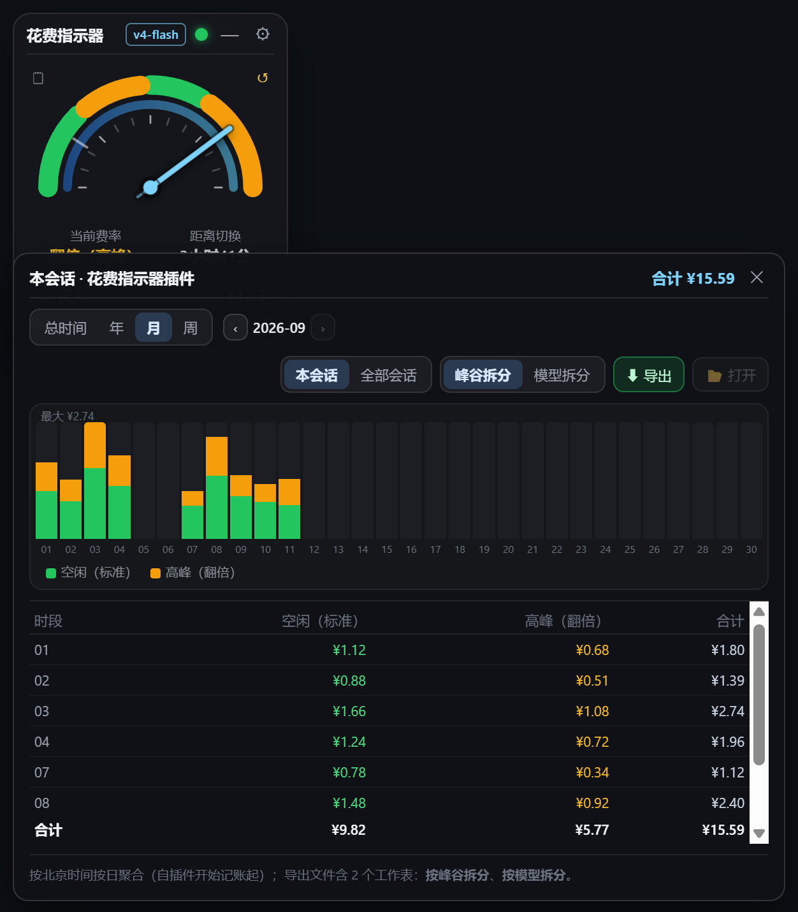

# dsh-cost-gauge

中文 | [English](README.en.md)

DeepSeek Harness（`dsh`）的**花费指示器**：Web 界面**左侧靠上**的方形浮动窗，实时显示会话花费与余额；**半圆表盘**指针随北京时间走动，弧色按当日费率带显示（绿=标准 / 黄=高峰，周末全天绿）；余额低于阈值时顶部红灯报警；支持**拖拽缩放**与**最小化**（状态灯 + 倒计时饼图 + 模型徽标）。

> 🔀 **相关项目**：v1.4 起新增的「极简时钟 / 多皮肤」改版线已独立为 **[dsh-cost-gauge-plus](https://github.com/wjingshan/dsh-cost-gauge-plus)**；本仓库保持 **v1.0 经典形态（方形指针表）**继续开发，两者互不干扰。

## 截图

| 展开态 | 最小化态 |
| --- | --- |
|  |  |

> 左：展开态（工作日高峰：表盘绿/黄双色、黄色弧段=高峰时段）；右：最小化态（费率灯 + 所剩时间饼图 + 会话费/余额 + 模型缩写徽标）。

## 本次更新（v1.3.0）

| 花费记录面板 | 设置项 | 表盘端头修正 |
| --- | --- | --- |
|  |  |  |

- **费用计算口径修正**：改为回放会话日志、按「事件发生时刻的费率 × 当时的模型」逐笔计价——空闲时段按空闲价、高峰时段按高峰价，两者相加；修掉了旧版"进入高峰后整段历史按高峰价重算（费用翻倍）"的问题。
- **新增「记录 / 归零」两个图标按钮**（表盘左上/右上，无边框小图标，悬停显示提示）：记录面板支持 `总时间 / 年 / 月 / 周` 筛选与翻页、**柱状图**（峰谷/模型堆叠）、明细表格；明细只列**有使用记录**的时段；范围可切 `本会话 / 全部会话`；面板可拖动、可覆盖指示器、越界自动拉回窗口内。归零为两步确认，把当前累计作为基线后从 ¥0.00 重新累计（不删历史）。
- **导出 Excel 升级为真正的 `.xlsx`**（OOXML，零依赖手写 zip 写入器，Excel/WPS 直接打开无格式警告）：两个工作表 + 首行导出说明；**默认文件名 `<会话名称>_<起>-<止>.xlsx`**；可在设置里指定默认保存文件夹（已设置则直接落盘不弹窗），导出后 `📂 打开` 直接定位到文件。
- **宿主侧记账**：每 15 秒回放会话事件日志并持久化到 `~/.dsh/cost-gauge/ledger.json`，仪表盘没打开时也在记；记录覆盖会话完整历史。
- **表盘端头修正**：黄段（高峰）在内部边界（9:00 / 12:00 / 14:00）按圆头半径内缩 5.43°，圆头外缘正好压线、不再盖住相邻绿段；18:00 端头保持原来的圆头外观。
- **中英双语界面**：跟随 DSH 客户端语言设置，取不到时跟随系统/浏览器语言（`zh*` → 中文，其余 → English）。

## 功能

- 🔲 **方形浮动窗**：默认停在界面左侧靠上，可按住标题栏拖动，位置自动记忆。
- 💰 **会话花费**：按官方峰谷价实时换算当前会话的 token 花费（缓存命中/未命中、输出分桶计价）。
  - **逐笔按当时费率计价**：空闲时段产生的用量按空闲价、高峰时段产生的用量按高峰价，两者相加；进入高峰**不会**把之前的空闲用量也按高峰价重算。
- 🧭 **费率指针**：指针摆向「标准（空闲）」或「翻倍（高峰）」，并显示距下一次切换的倒计时。
  - 高峰（翻倍）：北京时间周一至周五 09:00–12:00、14:00–18:00
  - 空闲（标准）：其余时间（含周六、周日全天），价格为高峰的一半
- 🔴 **红灯报警**：余额低于阈值（默认 ¥10）时，窗口顶部小红灯闪烁报警；余额充足时绿灯。
- ⚙️ **阈值可设**：点齿轮即可改报警阈值，立即生效并记住（localStorage）。
- 🗒 **每日花费记录**（表盘左上角图标）：宽面板展示花费记录，支持 **总时间 / 年 / 月 / 周** 时间筛选与翻页、**柱状图**（按峰谷或按模型堆叠）、明细表格与合计；范围可切 **本会话 / 全部会话**；明细只列**有使用记录**的时段（柱状图仍保留完整时间轴）；面板可拖动、可覆盖指示器，越界会自动拉回窗口内。
- ⬇ **导出 Excel**：导出当前筛选范围为**真正的 `.xlsx`**（OOXML；手写最小 zip 写入器，零第三方依赖，Excel/WPS 可直接打开、无格式警告），**含 2 个工作表**：`按峰谷拆分`、`按模型拆分`；两个表的首行是导出说明（会话名称、计费时间段、时间筛选、上次归零、导出时间）；**默认文件名 = `<会话名称>_<起>-<止>.xlsx`**（如 `花费指示器插件_20260808-20260911.xlsx`，全部会话则为 `全部会话_...`）；导出成功后可点 `📂 打开` 在资源管理器中定位文件。
- 📁 **默认保存位置**：在设置里指定文件夹后，导出**直接落盘、不弹窗**；未设置时会弹原生「选择文件夹」对话框并把所选目录记为默认（设置持久化在 `~/.dsh/cost-gauge/ledger.json`）。
- ↺ **会话花费归零**（表盘右上角图标）：两步确认后把当前累计作为基线，之后从 ¥0.00 重新累计（不删除历史记录）。
- 🧮 **宿主侧记账（日志回放）**：宿主每 15 秒回放各会话的**事件日志**（`assistant/message` / `assistant/attempt` 自带 usage 与时间戳，`request/header` 提供当时的模型），按「事件时刻的费率 × 当时的模型」逐笔计入「日期 × 峰谷 × 模型」并持久化到 `~/.dsh/cost-gauge/ledger.json`；`llm/retry-started` 与相同 turn/step 的重复样本按官方投影口径**替换**而非累加。因此仪表盘没打开时也在记，且记录覆盖会话日志里的**完整历史**（不限于插件安装之后）。
- 🌐 **中英双语界面**：跟随 DSH 客户端语言（设置 → 通用 → 语言），取不到时跟随系统/浏览器语言（`zh*` 显示中文，其余显示英文）。

## 安装

### 一键安装（推荐，无需 git）

PowerShell 复制整行回车（自动补齐 dsh，无需本机 git）：

```powershell
irm https://raw.githubusercontent.com/wjingshan/dsh-cost-gauge/main/install.ps1 | iex
```

> 一键安装**自动装最新稳定版**（GitHub 最新 Release tag，发版后无需改脚本）。想装开发版或锁指定版本，先下载脚本再带参数运行：
>
> ```powershell
> irm https://raw.githubusercontent.com/wjingshan/dsh-cost-gauge/main/install.ps1 -OutFile install-dsh-cost-gauge.ps1
> .\install-dsh-cost-gauge.ps1 -Ref main        # 装 main 开发版
> .\install-dsh-cost-gauge.ps1 -Ref v1.0.0      # 锁指定版本
> ```

仓库尚未推送时可先用本地脚本装（`-Source` 指定本地目录）：

```powershell
powershell -ExecutionPolicy Bypass -File .\install.ps1 -Source .\dsh-cost-gauge
```

### 手动安装（默认锁稳定版 v1.0.0）

```sh
# 从 git 安装（需要本机有 git，锁稳定版 tag）
dsh plugin --profile web add github:wjingshan/dsh-cost-gauge#v1.0.0

# 无 git 时用 tarball 直链（锁稳定版）
dsh plugin --profile web add https://github.com/wjingshan/dsh-cost-gauge/archive/refs/tags/v1.0.0.tar.gz

# 想装最新开发版（main 分支）
dsh plugin --profile web add github:wjingshan/dsh-cost-gauge#main

# 从本地目录安装（链接方式，改 lib/*.js 后刷新页面即生效）
dsh plugin --profile web add link:/path/to/dsh-cost-gauge
```

装完**重启** `dsh web`，刷新页面即可看到左上角浮动窗。

```sh
dsh web
```

## 配置

余额阈值既可在浮动窗里点齿轮改，也可在 profile 的 `cordis.patch.yml` 里覆盖：

```yaml
- update:
    - id: cost-gauge
      config:
        threshold: 10          # 余额报警阈值（人民币）
        baseUrl: 'https://api.deepseek.com'
        apiKeyEnv: 'DEEPSEEK_API_KEY'
        refreshSeconds: 30     # 余额查询缓存秒数
```

> 覆盖时需完整重述该行需要的全部 config 键（patch 按行整体替换 config，不做深合并）。

## 发布新版本

改完代码后，用 `release.ps1` 一条命令完成：提交 → 升版本 → 推送 → 创建 GitHub Release。

```powershell
.\release.ps1 -Message "feat: 新增 xxx"                 # 默认 patch（1.0.0 → 1.0.1）
.\release.ps1 -Type minor -Message "feat: 新增 xxx"     # minor（→ 1.1.0）
.\release.ps1 -Version 1.2.0 -Message "feat: 新增 xxx"  # 显式版本号
.\release.ps1 -Message "..." -DryRun                    # 预演（不真正执行）
```

- Release 说明默认从「上一个 tag 以来的提交历史」自动生成，也可 `-Notes "…"` 自定义。
- 创建 Release 需要 PAT：设置环境变量 `GH_TOKEN`（fine-grained，仓库权限 Contents 读写），或运行时按提示输入。
- 发版后无需改任何脚本——`install.ps1` 会自动安装最新 Release tag。

## 数据与安全

- 余额经官方 `GET /user/balance` 查询，API Key 只在宿主侧解析（credentials 接缝 / 环境变量），**绝不下发浏览器**。
- 花费由宿主读取会话的 `tokenUsage` 投影、按官方峰谷价换算；缓存写入不单独计费（与官方口径一致）。
- 纯 ESM、零运行时依赖：宿主不 import 任何包，浏览器半身是原生 JS（无 React）。

## 目录结构

```
dsh-cost-gauge/
├── package.json          # dsh.bundle（宿主）+ dsh.client（浏览器）声明
├── cordis.patch.yml      # 插件行插入（含默认 config）
├── install.ps1           # 一键安装脚本（irm … | iex）
├── release.ps1           # 一键发布脚本（提交+升版本+推送+创建 Release）
├── docs/
│   └── alipay-qr.jpg     # 支付宝收款码（README 赞助区引用）
├── lib/
│   ├── index.js          # 宿主半身：余额查询 + 花费统计 + 峰谷判定 + /api/cost-gauge/* 路由
│   └── client.js         # 浏览器半身：方形浮动窗（指针表 + 红灯 + 拖动 + 阈值设置）
└── README.md
```

## License

MIT

---

## ☕ 赞助

如果这个插件帮到了你，欢迎请我喝杯咖啡 ☕


<div align="center">

**感谢你的支持！** 💙

</div>
