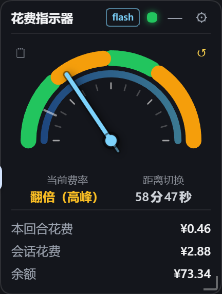
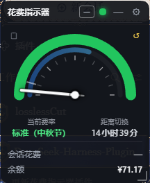
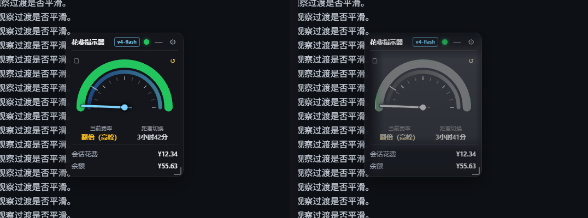
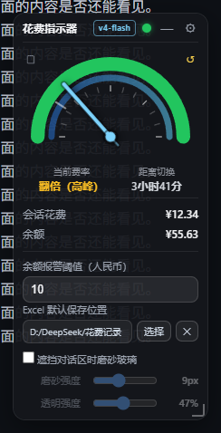
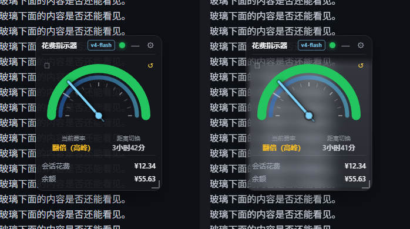
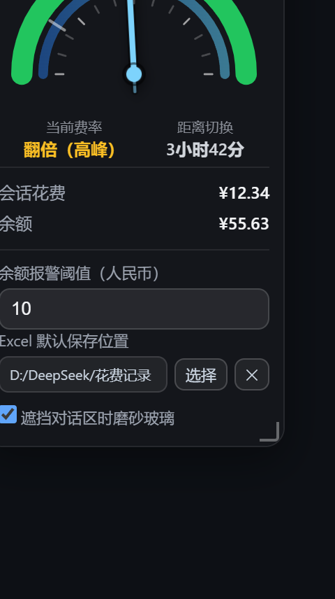
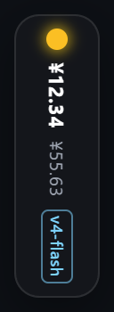
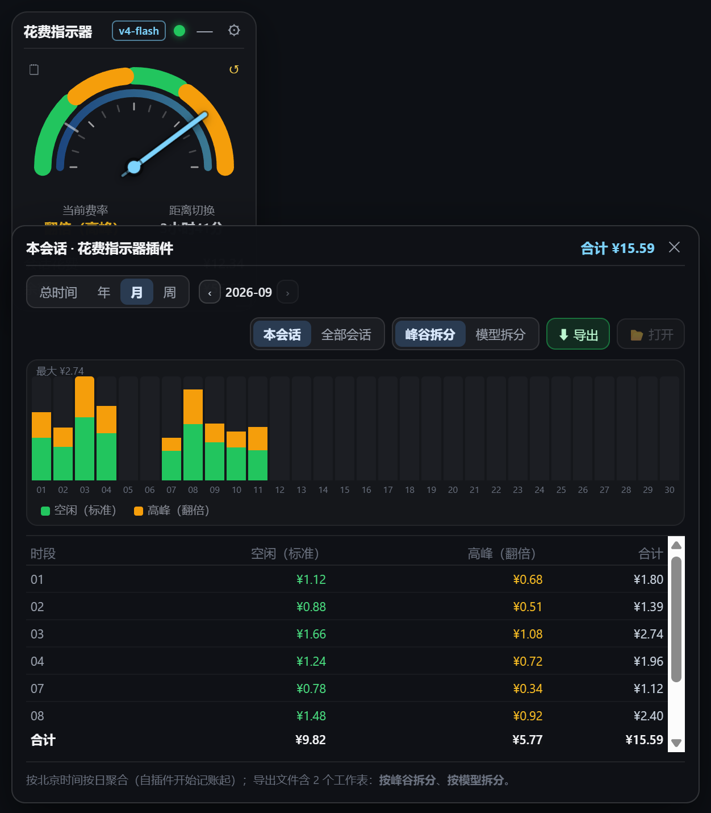
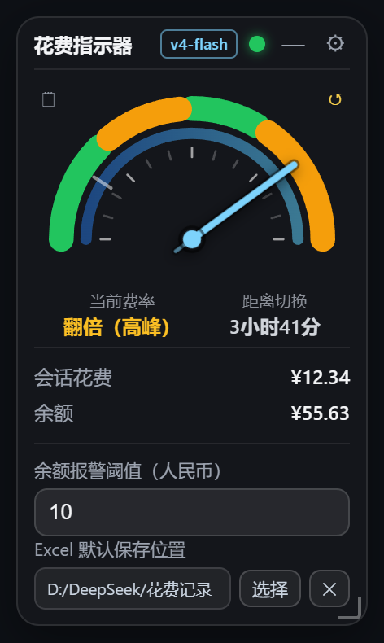
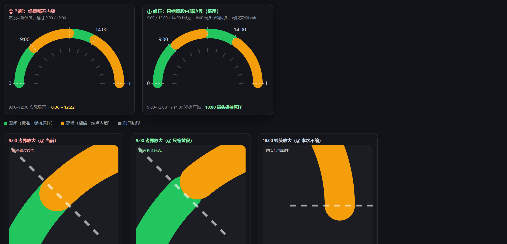

# dsh-cost-gauge

中文 | [English](README.en.md)

DeepSeek Harness（`dsh`）的**花费指示器**：Web 界面**左侧靠上**的方形浮动窗，实时显示会话花费与余额；**半圆表盘**指针随北京时间走动，弧色按当日费率带显示（绿=标准 / 黄=高峰，周末与法定节假日全天绿）；余额低于阈值时顶部红灯报警；支持**拖拽缩放**与**最小化**（状态灯 + 倒计时饼图 + 模型徽标）。

> 🔀 **相关项目**：v1.4 起新增的「极简时钟 / 多皮肤」改版线已独立为 **[dsh-cost-gauge-plus](https://github.com/wjingshan/dsh-cost-gauge-plus)**；本仓库保持 **v1.0 经典形态（方形指针表）**继续开发，两者互不干扰。

## 截图

| 展开态 | 最小化态 | 节假日态 |
| --- | --- | --- |
|  |  |  |

> 左：展开态（工作日高峰：表盘绿/黄双色、黄色弧段=高峰时段）；中：最小化态（费率灯 + 所剩时间饼图 + 会话费/余额 + 模型缩写徽标）；右：**节假日态**（中秋 9-25，整弧全绿、状态写明「标准（中秋节）」）。

## 本次更新（v1.6.1 – v1.6.3）

> 一轮面向 **dsh 0.1.7** 的适配更新，共三件事：**兼容性**、**节假日显示**、**花费显示修正**。

| 版本 | 主题 | 一句话 |
| --- | --- | --- |
| **v1.6.1** | 🧩 兼容性 | 0.1.7 删掉了三栏框架上的 `data-dsh-frame` —— 对话区几何量错、侧栏收起检测失灵，改为反查框架 |
| **v1.6.2** | 🗓 节假日显示 | 中国法定节假日（含调休补班）全天按空闲档计费：表盘全绿、切换时刻跳过节假日、文案写明原因 |
| **v1.6.3** | 💰 花费显示修正 | 0.1.7 把「当前选中会话」移出客户端 `sessions` 服务，会话花费与模型徽标恒为 `—`，改为多源取值 |

### v1.6.3 · 花费显示修正

**修复：会话花费与模型徽标显示不出来**（dsh 0.1.7 起，界面顶部只剩 `—`）。

DSH 0.1.7 把「**当前选中哪个会话**」从客户端的 `sessions` 服务里**移了出去**：`dsh-api-session-controller` 的列表快照现在只有 `ids / byId / phase / projectionsBySession` —— **没有 `current` 字段**（该文件自己的注释就写着 *"Host catalog and local reference allocator; **view selection remains outside the Controller**"*）。选中状态改由 `dsh-client-ui-workspace` **私有**维护，并且**没有** provide 成服务（0.1.7 客户端总共只提供 8 个服务：`sessions` / `layout` / `resources` / `modules` / `documentPreviews` / `uiRenderer` / `sidebarRightTabs` / `sidebarRight`），插件无从注入。

插件原先读 `ctx.sessions.list.getSnapshot().current` —— 在新版恒为 `undefined`，于是请求退化成**不带 `?session=`**，宿主拿不到会话就只返回到费率与余额，界面顶部只能显示 `—`。

- **改为多源取值**（新增 `currentSessionId()`，按可靠性依次尝试，任一成功即用）：
  1. `localStorage['dsh.sessions.current']` —— **DSH 自己**持久化的选择（形如 `{ sessionId }`）。`dsh-client-store` 的 `attachPersistence` 在每次状态变化时**同步**写回，所以它是实时信号，不是陈旧缓存。
  2. `[data-sidebar-right-session]:not([hidden])` —— 右栏当前会话元素，同样由 DSH 自己写入。
  3. 旧版快照的 `.current` —— 兼容 **0.1.6 及更早**。
- **三处调用点统一**：轮询取数、工作灯、记录面板/导出原本各自读 `.current`，现在都走 `currentSessionId()`。
- **连带修好「工作灯」**：`isSessionRunning()` 同样依赖 `.current`，所以「会话执行中」的标题灯发光与最小化态闪烁**此前一直是坏的**（永远不亮）。

### v1.6.2 · 节假日显示更新

**节假日费率**：中国法定节假日（含调休补班）**按空闲档计费**。此前表盘只按「星期几」判断，节假日一旦落在周一至周五，就会被错误地显示成**标准/高峰**。

- **新增 `lib/holidays.js`**：内置 **2026 年**国务院办公厅节假日安排（元旦 / 春节 / 清明 / 劳动节 / 端午 / 中秋 / 国庆），并区分**法定节假日**与**调休补班的周末**（如 9-20 周日、10-10 周六照常上班）。
- **节假日表盘全天全绿**：节假日当天（**即使落在周一至周五**）与周末一样整弧绿色，不再画出高峰黄段 —— 与官方「节假日按空闲时段计费」一致。
- **费率切换时刻顺延**：倒计时不再简单地跳到「下一个 9:00 / 12:00 / 14:00 / 18:00」，而是**跳过节假日与周末**。例如中秋前一天 18:30 会一路顺延到 **9-28（周一）09:00**；国庆前一天 19:00 顺延到 **10-08（周四）09:00**。空闲段的「总时长」也按同一规则计算，倒计时饼图的比例仍然正确。
- **状态文案说清原因**：工作日白天显示「标准」原本会与表盘上的黄段自相矛盾，现在直接写明 —— `标准（中秋节）` / `标准（调休上班）` / `标准（空闲）`。
- **数据覆盖提示**：设置面板版本行会显示 `节假日数据：2026 年（国务院办公厅通知）`；若当前年份尚未收录，则退化为**仅按星期判断**并转为橙色：`⚠ 节假日数据未收录 2027 年，费率仅按星期判断`。

> 明年（2027）的放假安排公布后，只需在 `lib/holidays.js` 里补一张年份表；`coveredYears()` 会自动把新年份带进上面的提示文案。

### v1.6.1 · 兼容性更新

适配 **dsh 0.1.7**：该版本把三栏主框架上的 `data-dsh-frame` 属性**删掉了** —— 框架上只剩 `data-sidebar-collapsed` / `data-rightbar-collapsed` / `data-panel-conversation` 这类**条件性**属性（不成立时根本不渲染），主框架不再能被直接选中。

- **修复：对话区几何量错**（实测确认）。`getChatAreaRect()` 原先靠 `[data-dsh-frame]` 拿三栏框架，再在它的直接子节点里挑出「中间对话列」。0.1.7 下该属性取不到，函数会**静默退回到全局搜索 `scrollBody`**：实测量到 **998×732**，而真正的中间列是 **1000×808**（高度少了 76px），并且内部的 `chatPanelEl` 永远停在 `null` —— 于是后面找 `scrollBody` / 输入卡时**不再限定在中间列内**。这会连带影响玻璃化「压进对话区」的判定与内容带对齐。现在改由新增的 `getFrameEl()` 反查框架，实测能正确选中 `centerCol`。
- **修复：侧栏收起检测**。收起信号现在优先读框架上的 `data-sidebar-collapsed`（`getFrameEl()` 先试旧属性以兼容 0.1.6 及以前，取不到则由侧栏列 / 中间列 / 右栏列**反查父节点**得到框架）。列宽兜底同时从 `w > 0 && w <= 96` 改为「**框架已布局** + 列宽 ≤ 96px」：Windows 标题栏模式下收起列宽为 **0**（且整列 0×0，列宽兜底本就取不到），旧判断会漏掉；而「框架是否已布局」是为了区分「真收起」与「首帧尚未布局」。
- **修正插件清单字段**：`dsh.client.inject` 里声明的 `@deepseek-ai/dsh-client-runtime` 在新版依赖树中已不存在，改为实际提供客户端 `sessions` 服务的 `@deepseek-ai/dsh-api-session-controller`。该字段只是**信息性**依赖（`dsh-client-modules` 对找不到的包静默忽略，所以旧值不会报错，只是过时）。

> 主进程侧的记账逻辑（会话事件读取、V4 会话格式、模型计价）经核对**无需改动**：0.1.7 的 `dsh-token-meter` 取值方式与本插件一致，模型目录仍是 `deepseek-flash`（V4.1-Flash）与 `deepseek-v4-pro`。

## 本次更新（v1.6.0）

| 玻璃化前后（左：未开启 · 右：开启 —— 只有压进对话文字的那块变了） |
| --- |
|  |

- **全新的玻璃化表现**：开启后，浮窗压进「对话内容列」的那一块会变成**灰色玻璃**：
  - **标题栏 / 底部「会话花费·余额」**：稍微透明（可调）；
  - **中间区域的背景**：完全透明 —— 露出底下被模糊的对话内容；
  - **中间的仪表盘与文字**：只保留**明度**（去掉色相与饱和度 = 灰阶），并且**每个颜色的不透明度 = 它的明度**（例如明度 80 → 不透明度 80%），所以不同颜色的透明程度各不相同。
- **只作用在压进对话区的那块矩形里**：没有进入对话区的部分**完全保持原样**（连仪表盘的颜色都不变）。做法是在 SVG 滤镜内部按矩形裁切 —— 洞内用变换结果、洞外用原图，洞边按「边缘过渡」羽化。
- **6 个设置项**（设置面板里，全部实时生效并记住）：

  | 设置 | 范围 | 默认 | 说明 |
  | --- | --- | --- | --- |
  | 磨砂强度 | 0–24px | 9px | 模糊半径，越大越糊 |
  | 透明强度 | 0–100% | 47% | 中间白雾的浓度，越大越通透 |
  | 边缘过渡 | 0–40px | 14px | 正常区 ↔ 玻璃区之间的过渡宽度（0 = 硬边） |
  | 标题/底部透明 | 0–60% | 15% | 标题栏与底部行的透明度（**0% = 完全不透明**） |
  | 内容不透明度 | 0–100% | 100% | 在明度之上再乘的系数：100% = 严格按明度，0% = 看不见（全程线性，每档都有效） |
  | 明度算法 | Rec.709 / HSL / HSV | Rec.709 | 用哪种「明度」定义灰度与不透明度 |
- **修复**：拖动「内容不透明度」或切换「明度算法」时，重建滤镜会把洞口矩形重置，导致变换消失、要等下一秒才恢复（表现为「拉滑杆没反应 / 不渐变」）；现在即时生效。顺带把该滑杆范围从 0–200% 收回到 **0–100%**。

## 本次更新（v1.5.3）

- **修复：会话花费长时间不动（记账游标越界）**：会话日志被压缩/重写后 seq 空间会变短，而账本里持久化的 `cursor` 仍停在旧 seq 空间，于是 `snapshotEvents(cursor, 日志末尾)` 永远返回空数组，新事件再也折不进账本——表现为「会话花费」长时间不涨、点了归零后一直是 ¥0.00。现在检测到 `cursor > session.seq` 时自动重建该会话账目，并从当前日志重新回放。
- **修复：表盘指针过了午夜逆时针倒退**：`dialPosOfHour()` 在 00:00–06:00 段方向写反（`90 - 15t`），指针到弧顶后又折回左端。改为夜间段与白天段同为「左端 → 弧顶 → 右端」单向扫过：夜间 **18:00 左端 → 24:00 弧顶 → 次日 06:00 右端**，白天 06:00 左端 → 12:00 弧顶 → 18:00 右端；06:00 与 18:00 两处为瞬时跳变。
- **设置面板底部标注当前版本号**：宿主 `/state` 下发 `version`（读自 `package.json`），设置面板最下方用 10px 次要色小字显示 `dsh-cost-gauge vX.Y.Z`；取不到版本时整行隐藏。

## 本次更新（v1.5.2）

| 设置：磨砂强度 / 透明强度 | 磨砂前后（左：未开启 · 右：开启） |
| --- | --- |
|  |  |

- **磨砂强度 / 透明强度可调**（设置面板里两个滑杆，实时生效并记住）：
  - **磨砂强度** `0–24px`：模糊半径，越大越糊（0 = 只保留通透的白雾）；
  - **透明强度** `0–100%`：越大越通透、白雾越淡，越能看清底下的内容。
- **标题栏不磨砂**：磨砂只作用于标题栏以下，标题栏始终原样不透明 —— 方便一眼定位、随手拖动。
- **边缘改为渐变过渡**：磨砂区与普通区之间不再是"一条线"，而是随磨砂强度自动加宽（5–18px）的渐变；实现上把"洞口"拆成「横向补集 ∪ 纵向补集」两段渐变遮罩（De Morgan），磨砂层用同一形状做遮罩，两侧同步渐隐。

## 本次更新（v1.5.1）

| 同一位置对比：未开启（左） / 开启磨砂后（右） |
| --- |
|  |

- **磨砂终于看得出来**：磨砂层原来只有 5% 白色 + `blur(12px)`——深色对话背景被模糊后还是同样的深色，等于看不出变化。现在改为**乳白渐变 + 轻微提亮 + 内描边**（`blur(9px) saturate(1.2) brightness(1.12)`）：实测同一块背景区域亮度 **29 → 83**，而底下文字模糊后仍保留结构（能看出文字位置）。
- **找不到开关？** 未开启磨砂时，只要浮窗压住对话文字（遮挡 ≥ 浮窗面积 35%），会**提示一次**「可在设置里开启『遮挡对话区时磨砂玻璃』」。
- **修复位置卡在左上角**：窗口最小化 / 后台标签页里加载时视口宽高为 0，「钳制到窗口内」会把浮窗位置算成 (0,0) 并写进 `localStorage`；现在视口为 0 时不做钳制。

## 本次更新（v1.5.0）

| 设置：新增「遮挡对话区时磨砂玻璃」开关 |
| --- |
|  |


- **窗口尺寸变化时自动让位**：拉伸/缩放窗口后，如果浮窗压住了中间对话的**文字区**，会自动挪进「文字区 ↔ 侧栏」之间的**留白**：留白够宽就停在**留白正中、靠下部分**（贴窗口底部；若会压到输入框，则停在输入框正上方 8px），留白不够宽才退回侧栏那一列。
  - 优先级：**中间文字区（绝不遮挡）> 底部输入框 > 两侧侧栏**；同分时保持「偏左往左、偏右往右」并尽量少移动。
  - 只在**窗口尺寸变化**时触发（150ms 防抖），不干扰手动拖拽；竖版小条模式下不参与。
  - 何时能停进留白：单侧留白需 ≥ 插件宽 + 16px。默认 216px 宽时约需**窗口 ≥ 1658px**（中间列 ≥ 1378px，侧栏 280 展开、右侧栏关闭）；缩到最小 180px 时约需 1458px。
- **遮挡对话区时的局部磨砂玻璃**（新增设置项，**默认关闭**）：开启后，浮窗与对话文字区相交的那一块会变成半透明磨砂（`backdrop-filter`），能看清被压住的文字；只磨砂真正遮挡文字的部分 —— 停在留白里不会变磨砂。实现为「背景层挖洞 + 磨砂层铺洞」（`mask-composite: exclude`）。
- **侧栏收起时自动停靠**：DSH 自动收起侧栏（或视口很窄）时，竖版小条自动停到**侧栏右侧**；侧栏展开时停到「会话 / 工作区」标题下方；退出竖版时回到原来的位置（停靠位置不写入本地存储）。
- 竖版小条宽度 48px → **36px**，更省空间；点一下仍可展开。
- 内部修正：让位与磨砂判定用的「对话内容区」改为按 `--dsh-chat-content-width`（面板内居中的内容列）计算，并正确解析 `clamp()/calc()` 表达式；取不到时依次退回「输入卡宽度 → 整个中间面板」，避免把面板两侧的留白误判成对话区。

## 本次更新（v1.4.0）

| 窗口变窄 → 竖版最小化 |
| --- |
|  |

- **窗口自适应（竖版最小化）**：用 `ResizeObserver` 观察视口宽度，**≤ 779px（即 < 780px）** 自动切换为 48px 宽的**竖版最小化**（自上而下：状态灯 → 会话花费 → 余额 → 模型徽标，均竖排），**点击即展开**；窗口回到 **≥ 860px** 自动恢复之前的展开/折叠状态。
  - 带**迟滞**（进入 780 / 退出 860），避免在临界点反复抖动；手动点开过竖版后，本段窄窗口内不再自动收窄（窗口回到 860px 以上才重新启用）。
  - 阈值可覆盖：`localStorage` 的 `dsh-cost-gauge:narrowEnter` / `dsh-cost-gauge:narrowExit`。

## 本次更新（v1.3.0）

| 花费记录面板 | 设置项 | 表盘端头修正 |
| --- | --- | --- |
|  |  |  |

- **费用计算口径修正**：改为回放会话日志、按「事件发生时刻的费率 × 当时的模型」逐笔计价——空闲时段按空闲价、高峰时段按高峰价，两者相加；修掉了旧版"进入高峰后整段历史按高峰价重算（费用翻倍）"的问题。
- **新增「记录 / 归零」两个图标按钮**（表盘左上/右上，无边框小图标，悬停显示提示）：记录面板支持 `总时间 / 年 / 月 / 周` 筛选与翻页、**柱状图**（峰谷/模型堆叠）、明细表格；明细只列**有使用记录**的时段；范围可切 `本会话 / 全部会话`；面板可拖动、可覆盖指示器、越界自动拉回窗口内。归零为两步确认，把当前累计作为基线后从 ¥0.00 重新累计（不删历史）。
- **导出 Excel 升级为真正的 `.xlsx`**（OOXML，零依赖手写 zip 写入器，Excel/WPS 直接打开无格式警告）：两个工作表 + 首行导出说明；**默认文件名 `<会话名称>_<起>-<止>.xlsx`**；可在设置里指定默认保存文件夹（已设置则直接落盘不弹窗），导出后 `📂 打开` 直接定位到文件。
- **宿主侧记账**：每 15 秒回放会话事件日志并持久化到 `~/.dsh/cost-gauge/ledger.json`，仪表盘没打开时也在记；记录覆盖会话完整历史。
- **表盘端头修正**：黄段（高峰）在内部边界（9:00 / 12:00 / 14:00）按圆头半径内缩 5.43°，圆头外缘正好压线、不再盖住相邻绿段；18:00 端头保持原来的圆头外观。
- **中英双语界面**：跟随 DSH 客户端语言设置，取不到时跟随系统/浏览器语言（`zh*` → 中文，其余 → English）。

## 功能

- 🔲 **方形浮动窗**：默认停在界面左侧靠上，可按住标题栏拖动，位置自动记忆。
- 📱 **窗口自适应**：窗口变窄（视口 ≤ 779px，即 < 780px）时自动切为 **36px 竖版最小化**（灯 + 花费 + 余额 + 模型徽标），点击展开；窗口恢复（≥ 860px）自动还原；侧栏自动收起时竖版小条会停靠到侧栏右侧、侧栏展开时停到「会话 / 工作区」标题下方。
- 🪟 **窗口变宽/变窄自动让位**：窗口尺寸变化时，若浮窗压住中间文字区，自动挪进「文字区 ↔ 侧栏」之间的留白（正中靠下）；优先级为 文字区 > 底部输入框 > 两侧侧栏。
- 🧊 **遮挡对话区的玻璃化**（设置里 6 个选项）：压进对话文字的那块变成灰色玻璃 —— 标题栏/底部行半透明、中间背景全透明、仪表盘与文字按「不透明度 = 明度」灰化；**没进入对话区的部分保持原样**。
- 💰 **会话花费**：按官方峰谷价实时换算当前会话的 token 花费（缓存命中/未命中、输出分桶计价）。
  - **逐笔按当时费率计价**：空闲时段产生的用量按空闲价、高峰时段产生的用量按高峰价，两者相加；进入高峰**不会**把之前的空闲用量也按高峰价重算。
- 🧭 **费率指针**：指针摆向「标准（空闲）」或「翻倍（高峰）」，并显示距下一次切换的倒计时。
  - 高峰（翻倍）：北京时间周一至周五 09:00–12:00、14:00–18:00
  - 空闲（标准）：其余时间（含周六、周日全天），价格为高峰的一半
- 🔴 **红灯报警**：余额低于阈值（默认 ¥10）时，窗口顶部小红灯闪烁报警；余额充足时绿灯。
- ⚙️ **阈值可设**：点齿轮即可改报警阈值，立即生效并记住（localStorage）。
- 🗒 **每日花费记录**（表盘左上角图标）：宽面板展示花费记录，支持 **总时间 / 年 / 月 / 周** 时间筛选与翻页、**柱状图**（按峰谷或按模型堆叠）、明细表格与合计；范围可切 **本会话 / 全部会话**；明细只列**有使用记录**的时段（柱状图仍保留完整时间轴）；面板可拖动、可覆盖指示器，越界会自动拉回窗口内。
- ⬇ **导出 Excel**：导出当前筛选范围为**真正的 `.xlsx`**（OOXML；手写最小 zip 写入器，零第三方依赖，Excel/WPS 可直接打开、无格式警告），**含 2 个工作表**：`按峰谷拆分`、`按模型拆分`；两个表的首行是导出说明（会话名称、计费时间段、时间筛选、上次归零、导出时间）；**默认文件名 = `<会话名称>_<起>-<止>.xlsx`**（如 `花费指示器插件_20260808-20260911.xlsx`，全部会话则为 `全部会话_...`）；导出成功后可点 `📂 打开` 在资源管理器中定位文件。
- 📁 **默认保存位置**：在设置里指定文件夹后，导出**直接落盘、不弹窗**；未设置时会弹原生「选择文件夹」对话框并把所选目录记为默认（设置持久化在 `~/.dsh/cost-gauge/ledger.json`）。
- ↺ **会话花费归零**（表盘右上角图标）：两步确认后把当前累计作为基线，之后从 ¥0.00 重新累计（不删除历史记录）。
- 🧮 **宿主侧记账（日志回放）**：宿主每 15 秒回放各会话的**事件日志**（`assistant/message` / `assistant/attempt` 自带 usage 与时间戳，`request/header` 提供当时的模型），按「事件时刻的费率 × 当时的模型」逐笔计入「日期 × 峰谷 × 模型」并持久化到 `~/.dsh/cost-gauge/ledger.json`；`llm/retry-started` 与相同 turn/step 的重复样本按官方投影口径**替换**而非累加。因此仪表盘没打开时也在记，且记录覆盖会话日志里的**完整历史**（不限于插件安装之后）。
- 🌐 **中英双语界面**：跟随 DSH 客户端语言（设置 → 通用 → 语言），取不到时跟随系统/浏览器语言（`zh*` 显示中文，其余显示英文）。

## 安装

### 一键安装（推荐，无需 git）

PowerShell 复制整行回车（自动补齐 dsh，无需本机 git）：

```powershell
irm https://raw.githubusercontent.com/wjingshan/dsh-cost-gauge/main/install.ps1 | iex
```

> 一键安装**自动装最新稳定版**（GitHub 最新 Release tag，发版后无需改脚本）。想装开发版或锁指定版本，先下载脚本再带参数运行：
>
> ```powershell
> irm https://raw.githubusercontent.com/wjingshan/dsh-cost-gauge/main/install.ps1 -OutFile install-dsh-cost-gauge.ps1
> .\install-dsh-cost-gauge.ps1 -Ref main        # 装 main 开发版
> .\install-dsh-cost-gauge.ps1 -Ref v1.5.0      # 锁指定版本
> ```

仓库尚未推送时可先用本地脚本装（`-Source` 指定本地目录）：

```powershell
powershell -ExecutionPolicy Bypass -File .\install.ps1 -Source .\dsh-cost-gauge
```

### 手动安装

> 插件市场（GitHub `dsh-plugin` 索引 / [awesome-dsh-plugin.com](https://awesome-dsh-plugin.com)）里给的那条安装命令，就是下面第一条 `github:wjingshan/dsh-cost-gauge`。它属于 **git 安装**，取的是 **`main` 分支的最新提交**，**与 GitHub Release 无关** —— 所以「正式版 / 开发版」之分只对上面的一键安装有意义：`install.ps1` 认的是 `/releases/latest`，市场认的是分支最新提交。

```sh
# 推荐：跟 main 分支 —— 插件市场能正常提示并执行「更新」
dsh plugin --profile web add github:wjingshan/dsh-cost-gauge#main

# 从本地目录安装（链接方式，改 lib/*.js 后刷新页面即生效）
dsh plugin --profile web add link:/path/to/dsh-cost-gauge

# 锁版本（不推荐，见下方说明：市场不会自动更新）
dsh plugin --profile web add github:wjingshan/dsh-cost-gauge#v1.6.0
dsh plugin --profile web add https://github.com/wjingshan/dsh-cost-gauge/archive/refs/tags/v1.6.0.tar.gz
```

> ⚠️ **关于插件市场的「更新」**：市场判断 git 安装能不能更新，看的是 **commit 有没有变**，不是版本号。
> - ✅ **想让市场能更新**：装**分支**写法（`#main`，或省略 ref 的 `github:owner/repo`）。
> - ❌ **别装成固定 tag**（`github:owner/repo#v1.6.0`）：市场的更新命令会把同一个 tag 再装一遍，于是必然报「更新命令执行完成，但版本没有变化，原因未能确认」——点重试也不会成功，只能手动改 spec。
> - 用 **Release tarball 直链**安装的市场**不会提示更新**（锁文件里没有可比较的 commit），需要更新时手动重装。

装完**重启** `dsh web`，刷新页面即可看到左上角浮动窗。

```sh
dsh web
```

## 配置

余额阈值既可在浮动窗里点齿轮改，也可在 profile 的 `cordis.patch.yml` 里覆盖：

```yaml
- update:
    - id: cost-gauge
      config:
        threshold: 10          # 余额报警阈值（人民币）
        baseUrl: 'https://api.deepseek.com'
        apiKeyEnv: 'DEEPSEEK_API_KEY'
        refreshSeconds: 30     # 余额查询缓存秒数
```

> 覆盖时需完整重述该行需要的全部 config 键（patch 按行整体替换 config，不做深合并）。

## 发布新版本

改完代码后，用 `release.ps1` 一条命令完成：提交 → 升版本 → 推送 → 创建 GitHub Release。

```powershell
.\release.ps1 -Message "feat: 新增 xxx"                 # 默认 patch（1.0.0 → 1.0.1）
.\release.ps1 -Type minor -Message "feat: 新增 xxx"     # minor（→ 1.1.0）
.\release.ps1 -Version 1.2.0 -Message "feat: 新增 xxx"  # 显式版本号
.\release.ps1 -Message "..." -DryRun                    # 预演（不真正执行）
```

- Release 说明默认从「上一个 tag 以来的提交历史」自动生成，也可 `-Notes "…"` 自定义。
- 创建 Release 需要 PAT：设置环境变量 `GH_TOKEN`（fine-grained，仓库权限 Contents 读写），或运行时按提示输入。
- 发版后无需改任何脚本——`install.ps1` 会自动安装最新 Release tag。
- `release.ps1` 内部会 `git add -A` 并提交，发版前先 `git status` 看一眼，别让临时截图 / 调试脚本跟着提交进去。

> ⚠️ **推了 tag 不等于发布了版本。** `install.ps1` 取的是 GitHub 的 **Release**（`/releases/latest`），不是最新的 tag。（插件市场给的是 `dsh plugin --profile web add github:wjingshan/dsh-cost-gauge`——那是 git 安装，取**默认分支最新提交**，与 Release 无关。）所以只 `git push --tags` 而没建 Release，**走 `install.ps1` 一键安装的人会静默停在旧版**上——v1.6.1 ~ v1.6.3 就踩过这个坑：三个 tag 都在远端，Release 却还停在 v1.6.0，直到补建才对齐。
>
> 发完版确认三处对齐（tag / Release / `main`）：
>
> ```powershell
> gh release list --limit 3                                             # 第一行应是刚发的 tag，且标着 Latest
> gh api repos/wjingshan/dsh-cost-gauge/releases/latest --jq .tag_name  # 应与刚发的 tag 一致
> ```
>
> 漏建了可以补（只是给已存在的 tag 挂上 Release，不动任何提交）：
>
> ```powershell
> gh release create v1.6.3 --repo wjingshan/dsh-cost-gauge --title v1.6.3 --notes-file notes.md
> ```
>
> `gh` 需要已登录（`gh auth login`）；也可以沿用脚本里的 PAT 方式，直接 `POST /repos/wjingshan/dsh-cost-gauge/releases` 并带上 `tag_name`。

## 数据与安全

- 余额经官方 `GET /user/balance` 查询，API Key 只在宿主侧解析（credentials 接缝 / 环境变量），**绝不下发浏览器**。
- 花费由宿主读取会话的 `tokenUsage` 投影、按官方峰谷价换算；缓存写入不单独计费（与官方口径一致）。
- 纯 ESM、零运行时依赖：宿主不 import 任何包，浏览器半身是原生 JS（无 React）。

## 目录结构

```
dsh-cost-gauge/
├── package.json          # dsh.bundle（宿主）+ dsh.client（浏览器）声明
├── cordis.patch.yml      # 插件行插入（含默认 config）
├── install.ps1           # 一键安装脚本（irm … | iex）
├── release.ps1           # 一键发布脚本（提交+升版本+推送+创建 Release）
├── docs/                 # 截图 / 预览页 / 支付宝收款码（README 引用）
├── lib/
│   ├── index.js          # 宿主半身：余额查询 + 花费统计 + 峰谷判定 + /api/cost-gauge/* 路由
│   ├── ledger.js         # 宿主半身：会话事件记账、账本持久化、XLSX 导出（零依赖）
│   ├── holidays.js       # 中国法定节假日表（2026）+ 调休补班日，供峰谷判定使用
│   └── client.js         # 浏览器半身：方形浮动窗（指针表 + 红灯 + 拖动 + 阈值设置）
└── README.md / README.en.md
```

## 反馈与建议

用得顺手、有想法，或者踩到坑了，都欢迎到 [Issues](https://github.com/wjingshan/dsh-cost-gauge/issues) 说一声——我会尽量回复。

- 🐛 **报 Bug**：附上 dsh 版本、插件版本和复现步骤；有截图最好（浮动窗截图最直观）。
- 💡 **提建议 / 新功能**：直接开 issue 描述使用场景即可，不必先写实现方案。
- ⭐ **觉得好用**：点个 Star 就是最实在的支持，也能让更多人看到这个插件。

> 想直接提交代码的话，建议先开个 issue 对齐思路再发 PR，避免白做。

## License

MIT

---

## ☕ 赞助

如果这个插件帮到了你，欢迎请我喝杯咖啡 ☕


<div align="center">

**感谢你的支持！** 💙

</div>
